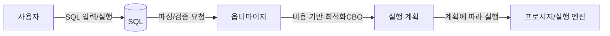
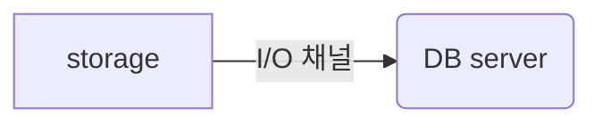
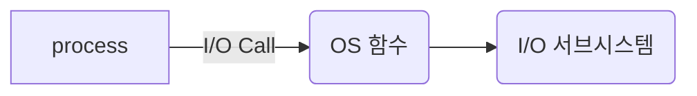
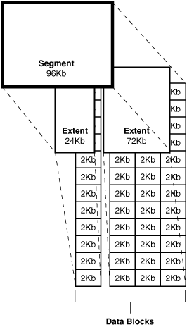
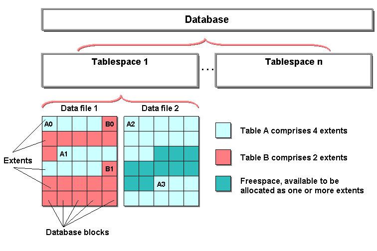
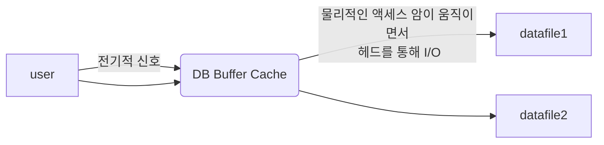

# SQL 처리 과정과 I/O

## SQL 파싱과 최적화
SQL 은 Structured Query Language 로, 구조적 질의 언어다. Oracle 의 PL/SQL 처럼 절차적 (procedural) 프로그래밍 기능을 구현할 수 있는 확장 언어도 제공하지만, SQL 은 기본적으로 구조적이고 집합적이며 선언적인 질의 언어다.

SQL 은 원하는 결과 집합을 구조적·집합적으로 선언하지만, 그 결과 집합을 실제로 만들어 내는 과정은 DBMS 내부에서 절차적일 수밖에 없다. 따라서 이를 수행할 프로시저가 필요한데, 이 프로시저를 만들어 내는 DBMS 내부 엔진이 바로 옵티마이저 (optimizer) 다. 즉, 옵티마이저가 프로그래밍을 대신해 준다.

DBMS 내부에서 이 프로시저를 생성하고, 컴파일하여, 실행 가능한 상태로 만드는 전 과정을 SQL 최적화 (SQL optimization) 라고 한다.




### SQL 최적화

SQL 실행 전 최적화 과정을 세분화하면 아래와 같다.

#### SQL 파싱

사용자로부터 SQL 을 받으면 가장 먼저 SQL 파서가 파싱을 수행한다. 파싱 단계에서는 파싱 트리를 생성하고, 문법(syntax)을 검사하며, 존재하지 않는 테이블을 참조하거나 권한이 없는 객체에 접근하는지 등을 확인하는 의미(semantic) 체크를 수행한다.

#### SQL 최적화

최적화는 옵티마이저가 담당한다. 옵티마이저는 미리 수집된 시스템 및 오브젝트 통계 정보를 바탕으로 다양한 실행 경로를 생성해 비교한 뒤, 가장 효율적인 하나를 선택한다.

#### 로우 소스 생성

옵티마이저가 선택한 실행 경로를 실제 실행 가능한 코드 또는 프로시저 형태로 포맷하는 단계다. 이 단계는 로우 소스 생성기가 수행한다.

#### 로우 소스 생성
옵티마이저가 선택한 실행 경로를 실제 실행가능한 코드 또는 프로시저 형태로 포맷하는 단계로, 로우 소스 생성기가 한다.


### 옵티마이저

1. 사용자로부터 전달받은 쿼리를 수행하는 데 후보가 될 만한 실행 계획을 찾아낸다.
2. 데이터 딕셔너리에 미리 수집해 둔 오브젝트 통계 및 시스템 통계 정보를 이용해 각 실행 계획의 예상 비용(cost)을 산정한다.
3. 최저 비용을 나타내는 실행 계획을 선택한다.

실행 계획은 옵티마이저가 생성한 처리 절차를 사용자가 확인할 수 있도록 트리 구조로 표현한 것이다. 이를 통해 SQL 이 인덱스를 스캔하는지 확인할 수 있고, 예상과 다른 방식으로 처리된다면 실행 경로를 변경할 수 있다.

이때 판단 기준으로 사용하는 cost 는 옵티마이저가 여러 통계 정보를 활용해 계산한 예상치다. 따라서 실제 수행 시간과 차이가 많이 날 수 있다.

옵티마이저는 대부분 좋은 선택을 하지만, 쿼리가 복잡할수록 실수할 가능성도 커진다. 이 경우 힌트(hint)를 통해 데이터 액세스 경로(access path)를 바꿀 수 있다.

통계 정보나 실행 환경 변화로 옵티마이저가 가끔 실수해도 별문제가 없는 시스템이 있는가 하면, 작은 실수가 기업에 큰 손실을 끼칠 수도 있다. 이런 시스템은 옵티마이저의 자율적 판단에 맡기기보다는, 힌트를 빈틈없이 사용하는 편이 좋다.


## SQL 공유 및 재사용
라이브러리 캐시는 SQL 파싱, 최적화, 로우 소스 생성 과정을 거쳐 생성한 내부 프로시저를 반복 재사용할 수 있도록 캐싱해 두는 메모리 공간이다. 이는 SGA(System Global Area)의 구성 요소로, SGA 는 서버 프로세스와 백그라운드 프로세스가 공통으로 액세스하는 데이터와 제어 구조를 캐싱하는 메모리 공간이다.


사용자가 SQL 을 전달하면 DBMS 는 SQL 을 파싱한 후, 해당 SQL 이 라이브러리 캐시에 존재하는지 확인한다. 존재하면 실행 단계로 넘어가고, 존재하지 않으면 최적화 단계까지 수행한다. 이때 캐시에 있는 내부 프로시저를 재사용해 곧바로 실행 단계로 넘어가는 것을 소프트 파싱이라 하고, 파싱부터 최적화까지 모든 과정을 수행하는 것을 하드 파싱이라 한다.

SQL 최적화는 생각보다 훨씬 많은 일을 수행한다. 예를 들어 5개의 테이블을 조인한다고 하면 조인 순서만 해도 5! 가지가 가능하다. 여기에 테이블을 풀 스캔할지, 인덱스를 사용할지 같은 선택까지 고려하면 경우의 수는 수만 가지로 늘어난다. 옵티마이저는 아래 정보를 활용해 이처럼 방대한 탐색과 계산을 매우 짧은 시간 안에 끝낸다.

- 테이블, 컬럼, 인덱스 구조에 관한 기본 정보
- 오브젝트 통계(테이블, 인덱스, 컬럼 통계)
- 시스템 통계(CPU 속도, single block I/O 속도, multiblock I/O 속도 등)
- 옵티마이저 관련 파라미터

DBMS 에서 수행되는 작업 대부분은 I/O 중심이지만, 하드 파싱은 CPU 를 많이 소비하는 몇 안 되는 작업 중 하나다. 이렇게 어렵게 만든 내부 프로시저를 한 번 사용하고 버리는 것은 비효율적이므로, 이를 재사용하기 위한 라이브러리 캐시가 필요하다.


### 바인드 변수의 중요성

사용자 정의 프로시저, 트리거 등은 생성할 때 이름을 갖고, 컴파일된 상태로 데이터 딕셔너리에 저장된다. 사용자가 삭제하지 않는 한 영구히 보관되며, 실행 시 라이브러리 캐시에 적재되어 여러 사용자가 공유하면서 재사용한다.

반면 SQL 은 전체 SQL 텍스트가 이름 역할을 하며, 데이터 딕셔너리에 저장되지 않는다. 처음 실행할 때 최적화 과정을 통해 동적으로 생성된 내부 프로시저가 라이브러리 캐시에 적재되고, 이후 여러 사용자가 이를 공유하며 재사용한다. 캐시 공간이 부족하면 제거되었다가, 다음에 다시 실행할 때 동일한 최적화 과정을 거쳐 다시 캐시에 적재된다.

SQL 은 함수나 프로시저처럼 영구 저장하지 않는다. DBMS 에서 수행되는 SQL 은 완성된 형태로 고정되어 있지 않고, 수시로 변경되거나 일회성인 경우도 많다. 이런 SQL 까지 모두 저장하려면 막대한 공간이 필요하므로, Oracle 은 SQL 을 영구 저장하지 않는 방식을 택했다.

#### 공유 가능 sql

라이브러리 캐시에서 SQL 을 찾을 때 키는 SQL 문 자체이므로, 아래는 모두 서로 다른 SQL이다. 따라서 각각 최적화를 수행하고, 라이브러리 캐시의 별도 공간에 저장된다.

```agsl
select * from emp where empno = 1;
SELECT * from emp where empno = 1;
...
```

만약 아래와 같이 SQL 을 문자열로 매번 만들어 실행한다면, 수백만 고객에 의해 발생하는 하드 파싱으로 CPU 사용률이 올라가고, 라이브러리 캐시에서 다양한 경합이 발생해 정상 처리가 어려워질 수 있다.

```kotlin
fun login(loginId: String) {
    val sql = "SELECT * FROM CUSTOMER WHERE LOGIN_ID = '" + loginId + "'";
    executeQuery(sql)
}
```

실제로 라이브러리 캐시에는 아래와 같이 값이 포함된 형태로 SQL 이 저장된다.

```agsl
SELECT * FROM CUSTOMER WHERE LOGIN_ID = 'A'
SELECT * FROM CUSTOMER WHERE LOGIN_ID = 'B'
...
```

즉, 내부적으로는 아래처럼 SQL 마다 별도의 처리 절차가 만들어져 캐시에 적재되는 것과 비슷한 효과가 난다.

```
# 
create procedure LOGIN_A() {}
create procedure LOGIN_B() {}
...
```

이보다는 loginId 를 파라미터로 받는 하나의 처리 절차를 공유해서 재사용하는 편이 훨씬 효율적이다. 이를 위해 바인드 변수를 사용하면 파라미터 기반으로 SQL 을 작성할 수 있고, 하드 파싱은 한 번만 수행한 뒤 캐시된 실행 계획을 재사용할 수 있다.

```
create procedure LOGIN(login_id in varchar2) {...}
```


## 데이터 저장 구조 및 I/O 메커니즘

SQL 이 느린 이유는 대부분 디스크 I/O 때문이다. 



실행 중인 프로세스가 디스크에서 데이터를 읽어야 할 때는 CPU 를 OS 에 반환하고(waiting 상태로 전환되어) I/O 가 완료되길 기다린다. 즉, OS 함수(I/O call)를 호출한 뒤 CPU 를 반환하고, 완료 알림을 등록한 채 대기 큐에서 기다리는 구조다. 열심히 일해야 할 프로세스가 대기하게 되므로, I/O 가 많아질수록 성능은 느려진다.



I/O call 속도는 싱글 블록 I/O 기준으로 평균 10ms 정도다. 초당 약 100블록을 읽는 셈이다. 큰 캐시를 가진 SAN 스토리지는 4~8ms 수준으로 초당 125~250블록, SSD 까지 활용하는 최근 스토리지는 1~2ms 수준으로 초당 500~1000블록 정도까지 가능하다.

스토리지 성능이 좋아지고는 있지만 여전히 충분하지 않다. 예를 들어 어떤 SQL 이 싱글 블록으로 10,000블록을 읽는다면, 최신 스토리지에서도 10초 이상을 기다려야 한다. 여기에 수많은 프로세스가 동시에 I/O 를 발생시키면 디스크 경합이 심해지고 대기 시간도 더 늘어난다. 결국 디스크 I/O 가 SQL 성능을 좌우한다고 생각하면 된다.

### 데이터베이스 저장 구조
- 블록 : 데이터를 읽고 쓰는 단위
- 익스텐트 : 공간을 확장하는 단위, 연속된 블록 집합
- 세그먼트 : 데이터 저장공간이 필요한 오브젝트(데이블, 인덱스, 파티션, LOB 등)
- 데이블스페이스 : 세그먼트를 담는 콘테이너
- 데이터파일 : 디스크 상의 물리적인 OS 파일

데이터를 저장할 때는 먼저 테이블스페이스를 생성한다. 테이블스페이스는 세그먼트를 담는 컨테이너이며, 여러 데이터파일(물리적인 OS 파일)로 구성된다.



그다음 세그먼트를 생성한다. 세그먼트는 테이블, 인덱스처럼 데이터 저장 공간이 필요한 오브젝트를 의미하며, 테이블이나 인덱스를 생성할 때 데이터를 어떤 테이블스페이스에 저장할지 지정한다.

세그먼트는 여러 익스텐트로 구성된다. 파티션 구조가 아니라면 테이블과 인덱스는 각각 하나의 세그먼트이고, 테이블 또는 인덱스가 파티션 구조라면 각 파티션이 하나의 세그먼트가 된다.

익스텐트는 공간을 확장하는 단위다. 테이블이나 인덱스에 데이터를 입력하다가 공간이 부족해지면, 해당 오브젝트가 속한 테이블스페이스로부터 익스텐트를 추가로 할당받는다.

익스텐트는 연속된 블록의 집합이기도 하다. 익스텐트 단위로 공간을 확장하지만, 사용자가 입력한 레코드를 실제로 저장하는 공간은 데이터 블록이다. 한 블록에 저장된 레코드는 모두 같은 테이블의 레코드이며, 한 블록은 하나의 테이블이 독점한다.

익스텐트도 하나의 테이블이 독점하므로, 한 익스텐트에 포함된 블록은 모두 같은 테이블 블록이다. (DBMS 에 따라 세부 동작은 다를 수 있다.)

세그먼트 공간이 부족하면 테이블스페이스로부터 익스텐트를 추가로 할당받는데, 세그먼트에 할당된 모든 익스텐트가 같은 데이터파일에 위치하지 않을 가능성이 크다. 하나의 테이블스페이스를 여러 데이터파일로 구성하면 파일 경합을 줄이기 위해 DBMS 가 데이터를 가능한 한 여러 데이터파일로 분산해서 저장하기 때문이다.




위 그림에서 알 수 있듯이, 익스텐트 내부의 블록은 서로 인접한 연속된 공간이지만, 익스텐트와 익스텐트는 서로 연속된 공간이 아닐 수도 있다.

### 블록 단위 I/O

DBMS 에서 데이터를 읽고 쓰는 최소 단위는 블록이다. 즉, 1 byte 크기의 특정 레코드 하나만 읽고 싶더라도, 실제로는 해당 레코드가 포함된 블록 전체를 통째로 읽는다. Oracle 은 기본적으로 8 KB 크기의 블록을 사용한다.

### 시퀀셜 액세스 vs 랜덤 액세스

데이터 접근 방식은 크게 시퀀셜 액세스와 랜덤 액세스로 구분된다. 시퀀셜 액세스는 블록을 순서대로 읽는 방식이고, 랜덤 액세스는 순서를 따르지 않고 필요한 블록을 선택적으로 읽는 방식이다.

시퀀셜 액세스는 익스텐트가 여러 데이터파일에 분산되어 있거나, 익스텐트끼리 물리적으로 연속되지 않은 상황에서도 가능하다. 그 이유는 세그먼트 헤더에 있는 익스텐트 맵(map) 때문이다. 세그먼트는 자신에게 속한 각 익스텐트를 찾아갈 수 있도록, 맵에 각 익스텐트의 첫 번째 블록 주소를 기록해 둔다. DBMS 는 이 주소 정보를 따라가며 한 익스텐트 내부의 블록을 처음부터 끝까지 순서대로 읽고, 다음 익스텐트의 첫 블록으로 이동해 다시 순서대로 읽는 과정을 반복한다. 결과적으로 익스텐트가 흩어져 있어도 논리적으로는 “연속해서” 읽는 시퀀셜 액세스를 수행할 수 있다.

랜덤 액세스는 블록을 연속으로 읽지 않고, 조건에 맞는 데이터가 있을 가능성이 높은 블록을 골라 한 블록씩 점프하며 접근하는 방식이다. 인덱스를 통해 특정 키 값이 위치한 블록을 찾아가는 접근이 대표적이다.


## 논리적 I/O vs 물리적 I/O

DBMS 는 디스크에서 어렵게 읽어 온 데이터 블록을 캐싱해, 같은 블록에 대한 반복적인 I/O call 을 줄인다. SGA 의 구성 요소 중 DB Buffer Cache가 이에 해당한다. 이 버퍼 캐시에 이전에 읽었던 데이터를 저장해 두고, 나중에 같은 데이터를 읽을 때는 디스크에 접근하지 않고 캐시에서 곧바로 읽을 수 있다.


논리적 I/O는 SQL 을 처리하는 과정에서 메모리의 버퍼 캐시에서 발생한 총 블록 I/O를 의미한다. 반면 물리적 I/O는 디스크에서 발생한 총 블록 I/O를 의미한다. 캐시 메모리는 물리 메모리에 존재하므로, 디스크 I/O 에 비해 대략 10,000배 정도 빠르다고 볼 수 있다.




SQL 을 수행하려면 데이터가 담긴 블록을 읽어야 한다. 특정 SQL 이 참조하는 테이블에 변경이 없고 같은 변수를 입력한다면, 몇 번을 수행해도 SQL 수행 과정에서 참조하게 되는 블록 수 자체는 동일하다. 이때 SQL 수행 과정에서 읽은 총 블록 I/O 수가 곧 논리적 I/O 다.

논리적 I/O 를 “버퍼 캐시에서 발생하는 블록 I/O”라고 표현하는 이유는 간단하다. Direct Path Read 같은 예외를 제외하면, 대부분의 블록은 DB Buffer Cache 를 경유해 읽히기 때문이다. 따라서 논리적 I/O 횟수는 곧 DB Buffer Cache 에서 블록을 읽은 횟수와 동일하다고 볼 수 있다.

반면 버퍼 캐시에서 블록을 찾지 못하면(캐시 미스) 디스크에서 해당 블록을 읽어 와야 하고, 이를 물리적 I/O라고 한다. 앞선 조건처럼 테이블의 데이터 변경이 없고 같은 변수를 입력하더라도, 물리적 I/O 는 매번 동일하지 않을 수 있다. 예를 들어 첫 번째 실행에서는 디스크에서 블록을 많이 읽지만, 이후 실행에서는 캐시에 적재된 블록이 재사용되면서 물리적 I/O 가 감소하는 경우가 흔하다.

흔히 SQL 튜닝은 논리적 I/O 를 줄여서, SQL 이 읽어야 하는 블록 자체를 줄이는 것을 의미한다. 물리적 I/O 는 캐시 상태 같은 외부 요인에 따라 매번 달라질 수 있어 직접 통제하기 어렵다. 따라서 논리적 I/O 를 줄이면, 결과적으로 통제하기 어려운 변수인 물리적 I/O 도 자연스럽게 함께 감소한다.

## Single Block vs MultiBlock IO

캐시에서 찾지 못한 블록은 디스크로부터 DB Buffer Cache로 적재한 뒤 읽는다. 이때 발생하는 I/O 요청은 한 번에 한 블록씩 가져오기도 하고, 여러 블록을 한꺼번에 가져오기도 한다. 한 번의 요청으로 한 블록을 읽는 방식을 Single Block I/O라 하고, 한 번의 요청으로 여러 블록을 읽는 방식을 Multi Block I/O라 한다.

인덱스를 이용할 경우에는 기본적으로 인덱스 블록과 테이블 블록 모두 Single Block I/O 방식으로 읽는다. 인덱스는 보통 소량의 데이터를 빠르게 찾는 데 사용되므로, 한 블록씩 필요한 부분만 읽는 방식이 효율적이기 때문이다.

반대로 많은 데이터 블록을 읽어야 할 때는 Multi Block I/O 방식이 더 효율적이다. 그래서 인덱스를 사용하지 않고 테이블 전체를 스캔할 때는 이 방식을 주로 사용한다. 필요한 블록이 많은데도 한 블록씩 가져오면 I/O 요청이 과도하게 늘어나고, 그만큼 대기(blocking)가 증가해 전체 요청 시간이 길어질 수 있다. 이런 이유로 특정 블록과 그 주변 블록을 한 번에 읽어들이는 Multi Block I/O 가 더 유리한 경우가 많다.

다만 주의할 점이 있다. DB 설정뿐 아니라 OS 수준에서도 I/O 단위가 정해져 있다. 따라서 Multi Block I/O 로 요청하는 크기가 OS 의 I/O 단위를 초과하면, OS 가 이를 한 번에 처리하지 못해 여러 번의 I/O 요청으로 쪼개어 처리할 수도 있다.

## Table Full Scan/Index Range Scan

기본적으로 테이블을 읽는 방식은 테이블 전체 스캔(Table Full Scan) 과 인덱스 기반 접근(Index Range Scan) 으로 나뉜다.

Table Full Scan은 테이블에 속한 블록 전체를 읽으면서 데이터를 찾는 방식이다. 반면 인덱스를 이용하는 방식은 인덱스에서 일정 구간을 스캔해 얻은 ROWID로 테이블 레코드를 찾아가는 방식이다.

Table Full Scan 은 시퀀셜 액세스와 Multi Block I/O 방식으로 디스크 블록을 읽는다. 반면 Index Range Scan은 랜덤 액세스와 Single Block I/O 방식으로 디스크 블록을 읽는다.

따라서 일정량 이상 데이터를 읽어야 한다면 Table Full Scan 이 유리한 경우가 많다. 무조건 인덱스를 사용해서 읽는 것이 항상 좋은 선택은 아니다.

인덱스는 큰 테이블에서 아주 일부 데이터를 빠르게 찾기 위한 도구다. 따라서 모든 성능 문제를 인덱스로만 해결하려고 하면 오히려 비효율이 커질 수 있다.


## 캐시 탐색 매커니즘

블록을 읽을 때마다 DB Buffer Cache를 경유해, 찾는 블록이 캐시에 있는지 확인한다. 버퍼 캐시는 해시 구조이므로 블록 번호로 해당 블록의 버퍼 헤더를 찾고, 그 포인터를 따라 버퍼 블록에 액세스한다.

버퍼 캐시는 공유 자원이다. SQL 이 블록을 읽을 때마다 접근하기 때문에 요청이 많아질수록 버퍼 캐시에 대한 접근도 함께 증가한다. 이 과정에서 동시 접근이 많아지면 정합성(일관성) 문제로 이어질 수 있다.

여러 프로세스가 버퍼 캐시를 완전히 “동시에” 사용할 수는 없다. 여기서 말하는 동시는 우리가 일상에서 말하는 동시(예: 걸어가면서 음악을 들으면서 신호등을 본다)가 아니라, 아주 짧은 시간 단위로 번갈아 사용하거나 정해진 순서에 따라 자원을 사용하는 형태를 의미한다.

결국 버퍼 캐시도 프로세스들이 순서를 지켜 접근하도록 해야 하는데, 이를 위해 사용하는 직렬화 장치가 래치(latch) 다. 즉, “줄 서기”가 가능하도록 만드는 메커니즘이다.

또한 캐시 버퍼 체인뿐 아니라, 캐싱된 블록 자체(버퍼 블록)에 대해서도 유사한 직렬화 메커니즘이 적용된다. 이것이 버퍼 락(buffer lock) 이다.

래치와 락은 동시에 접근하는 프로세스들로 인해 발생할 수 있는 데이터 정합성 문제를 막기 위해 존재하지만, 그 대가로 줄 서기 자체에서 경합이 발생할 수 있다. 즉, 요청이 많아질수록 래치/락 경합이 커져 처리 시간이 오히려 증가하는 상황도 발생할 수 있다.

# 
- https://help.sap.com/saphelp_snc70/helpdata/de/45/0f8678f1394574e10000000a114a6b/content.htm?no_cache=true
- https://docs.oracle.com/cd/B13789_01/server.101/b10743/logical.htm