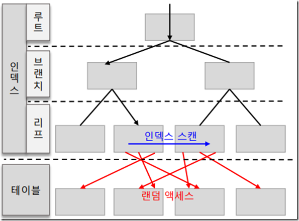
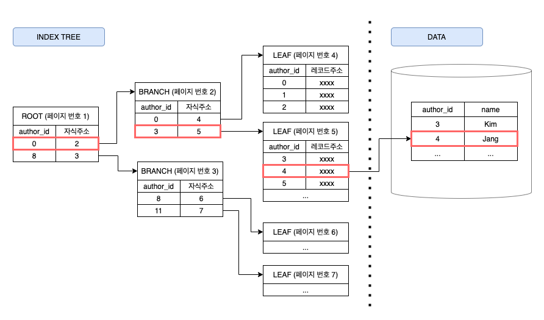
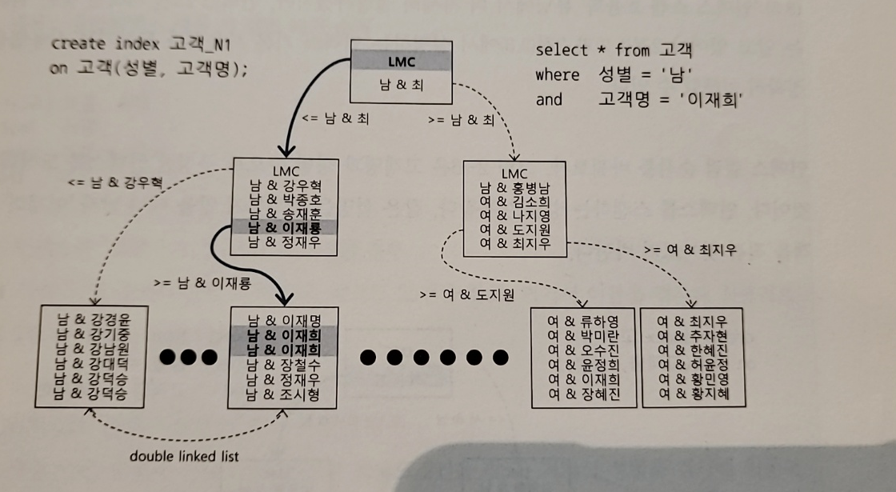

# 인덱스 기본

## 인덱스 구조 및 탐색

### 미리보는 인덱스 튜닝
데이터베이스 테이블에서 데이터를 찾는 방법은 크게 두가지다.

- 테이블 전체를 스캔한다
- 인덱스를 이용한다

인덱스는 큰 테이블에서 소량 데이터를 검색할 때 사용한다. 온라인 트랜잭션 처리 시스템에서는 주로 소량 데이터를 검색하므로 인덱스 튜닝이 중요하다.

튜닝의 핵심 요소는 크게 두가지다. 인덱스 스캔 과정에서 발생하는 비효율을 줄이는 인덱스 스캔 효율화 튜닝, 그리고 테이블 액세스 횟수를 줄이는 랜덤 액세스 최소화 튜닝이다. 인덱스 스캔 후 테이블 레코드를 액세스할 때 랜덤 I/O 방식을 사용하므로 랜덤 액세스 최소화 튜닝이라 한다.



둘 다 중요하지만 성능에 미치는 영향이 더 큰 랜덤 액세스 최소화 튜닝이 더 중요하다. SQL 튜닝은 랜덤 I/O 와의 전쟁이다.

데이터베이스 성능이 느린 이유는 디스크 I/O 때문이다. 읽어야 할 데이터가 많아, 이 과정에 디스크 I/O 가 많이 발생할 때 느리다. 인덱스를 많이 사용하는 OLTP 시스템이라면 디스크 I/O 중에서도 랜덤 I/O가 특히 중요하다.

성능을 위해 DBMS 가 제공하는 많은 기능이 느린 랜덤 I/O 를 줄이기 위해 개발되었다고 봐도 된다.

### 인덱스 구조

인덱스는 정렬되어 있기 때문에 범위 스캔이 가능하다. DBMS 는 일반적으로 B+Tree 인덱스를 사용한다. 루트와 브랜치 블록에 있는 각 레코드는 하위 블록에 대한 주소값을 갖는다. 키값은 하위 블록에 저장된 키값의 범위를 나타낸다.


루트와 브랜치 블록에는 키값을 갖지 않는 특별한 레코드인 Leftmost Child(LMC)를 가진다. LMC 는 자식 노드 중 가장 왼쪽 끝에 위치한 블록을 가리킨다. LMC 가 가리키는 주소로 찾아간 블록에는 키값을 가진 첫번째 레코드보다 작거나 같은 레코드가 저장되어 있다.

리프블록에 저장된 각 레코드는 키값 순으로 정렬되어 있으며 테이블 레코드를 가리키는 주소값인 ROWID 를 갖는다. 인덱스 스캔을 하는 이유는 검색조건에 만족하는 소량의 데이터를 빨리 찾고 거기서 ROWID 를 얻기 위해서다.



### 인덱스 수직적 탐색

정렬된 인덱스 레코드 중 조건을 만족하는 첫번쨰 레코드를 찾는 과정으로, 인덱스 스캔 시작지점을 찾는 과정이다.

인덱스 수직적 탐색은 루트에서 시작한다. 루트를 포함한 각 브랜치의 레코드는 하위 블록에 대한 주소값을 가지므로 루트에서 리프까지 수직적 탐색이 가능하다.

수직적 탐색 과정에 찾고자 하는 값보다 크거나 같은 값(key >= target)을 만나면 바로 직전 레코드가 가리키는 하위 블록으로 이동한다. 만약 브랜치에 찾고자 하는 값과 정확히 일치하는 레코드가 첫번째 레코드라 이전 레코드가 없다 하더라도 LMC 가 가리키는 블록을 찾아가야 한다. 그래야 이 과정을 반복하면 리프에 도달하여 조건에 만족하는 첫번째 레코드를 찾게 된다.

수직적 탐색은 조건을 만족하는 첫번째 레코드를 찾는 과정임을 기억해야 한다.

### 인덱스 수평적 탐색

찾고자 하는 데이터가 더 안 나타날 때까지 인덱스 리프 블록을 수평적으로 스캔한다. 인덱스 리프 끼리는 서로 앞뒤에 대한 주소값을 가지는 양방향 연결 리스트 구조다. 수평적으로 탐색하여 조건절에 만족하는 모든 데이터와 그에 대한 ROWID 도 확인할 수 있다.

### 결합 인덱스 구조와 탐색

인덱스 선두 컬럼을 모두 = 조건으로 검색할 떄는 어느 컬럼을 인덱스 앞쪽에 두든 읽는 인덱스 블록 개수가 같으므로, 블록 I/O 개수가 같아 성능도 같다.



---
아래와 같은 SQL 에서 인덱스를 (성별 + 이름) 으로 구성하면 총 50명 중 성별 = '여자'인 레코드 25건을 찾고, 여기서 이름을 검사하므로 25번의 I/O,
(이름 + 성별) 로 구성하면 총 50명 중 이름 = '유관순' 인 레코드 2건을 찾고, 여기서 성별을 검사하므로 2번의 I/O 가 발생한다. 
```sql
SELECT 이름, 성별
FROM   사원
WHERE  성별 = '여자'
AND    이름 = '유관순'
```

즉, 선택도가 낮은 이름 컬럼을 앞쪽에 두고 결합인덱스를 생성해야 성능에 유리하다.

**위 설명은 잘못된 설명이다.**
엑셀처럼 성별 필드로 필터링하고, 여기서 이름 필드로 필터링하는 방식으로 인덱스를 탐색하고 필터링한다면 (이름 + 성별) 순으로 구성해야 비교연산 횟수를 줄인다는 설명이 옳다.

다만 인덱스는 B+Tree 로 다단계 구조이고, 루트에서 브랜치를 거쳐 리프까지 탐색하면서 여자이면서 유관순이 첫번째 사원을 바로 찾아간다. 여기서 두 건을 스캔한다.
이는 인덱스를 (성별 + 이름)으로 구성해도 동일하다.

---


## 인덱스 기본 사용법

인덱스를 정상적으로 사용한다는 표현은 리프 블록에서 스캔 작점을 찾아 거기서부터 스캔하다가 중간에 멈추는 것을 의미하며, 이는 리프 일부만 스캔하는 Index range scan 을 의미한다.

### 인덱스 범위 스캔이 불가능한 경우

인덱스 컬럼을 가공해도 인덱스를 사용할 순 있지만, 스캔 시작점을 찾을 수 없고 멈출 수도 없어 리프 블록 전체를 스캔하여 Index Full Scan 이 된다. 

인덱스 컬럼을 가공했을 때 인덱스를 정상적으로 사용할 수 없는 이유는 인덱스 스캔 시작점을 찾을 수 없기 때문이다. 아래는 레인지 스캔이 불가능한 경우이다.

```sql
-- 20070101 형태로 저장되어있는 컬럼을 아래와 같은 조건절로 찾으면 스캔 지점을 찾을 수 없게 된다.
WHERE SUBSTR(birth, 5, 2) = '05'

-- 
WHERE NVL(count, 0) < 100

-- '허'로 시작하는 값은 특정 구간에 모여 있으므로 레인지 스캔이 가능하나, Like 로 중간값을 검색하는 경우 전체 구간을 탐색해야 한다.
WHERE name LIKE '%허%'

-- OR 인 경우 수직적 탐색을 통해 전화번호가 x 거나 이름이 y 인 어느 한 시작지점을 바로 찾을 수 없다.
WHERE (phone = :phone OR name = :name)
```

---
다만 OR 의 경우 아래와 같이 구성하면 인덱스 레인지 스캔이 가능하다.

```sql
SELECT  *
FROM    customer
WHERE   name = :name        -- 이름이 선두 컬럼인 인덱스 레인지 스캔
UNION ALL
SELECT  *
FROM    customer
WHERE   phone = :phone      -- 전화번호가 선두 컬럼인 인덱스 레인지 스캔
AND     (name <> name OR name IS NULL)
```

OR 조건식을 옵티마이저가 위와 같은 형태로 변환할 수 있는데, 이를 OR Expansion 이라 한다. use_concat 힌트를 이용하면 OR Expansion 을 유도하여 인덱스 레인지 스캔을 이용할 수 있다.

```sql
SELECT /** use_concat */ * FROM customer
WHERE (phone = :phone OR name := name)


< 실행계확 >
```
---

IN 절도 OR 조건을 표현하는 다른 방식이므로 기본적으론 한 지점을 찾을 수 없다. 다만 UNION ALL 을 이용하면 각 브랜치 별로 인덱스 스캔 시작점을 찾을 수 있어 범위 스캔이 가능하다.

```sql
SELECT  *
FROM    customer
WHERE   name = :name
UNION ALL
SELECT  *
FROM    customer
WHERE   phone = :phone
```

옵티마이저는 IN 절에 대해 IN-List Iterator 방식을 이용하여 IN-List 개수만큼 인덱스 범위 스캔을 반복한다. 이러면 UNION ALL 로 변환한 것과 같은 효과를 얻을 수 있다.

< 실행계확 >

**당연하게도 결합 인덱스인 경우 결합 순서가 중요하다. (팀 + 이름 + 연령)으로 인덱스를 구성할 때 이름으로만 조회한다면 인덱스 스캔 시작 지점을 찾을 수 없어 리프를 모두 스캔해야 한다. 즉, 반드시 인덱스 선두 컬럼이 조건절에 있어야 인덱스 범위 스캔이 가능하다.
반면 다른 어떤 컬럼이 가공되었다 하더라도 선두 컬럼이 가공되지 않은 상태로 조건절에 있으면 인덱스 범위 스캔은 무조건 가능하다.**

### 소트 연산 생략

(장비번호, 변경일자, 변경순번) 으로 인덱스가 잡혀있고, 아래와 같이 조회한다고 하자.

```sql
SELECT *
FROM log
WHERE 장비번호 = 'C' AND 변경일자 = '20180316' ORDER BY 변경순번
```

인덱스는 항상 정렬되어 있다. 장비번호, 변경일자가 같은 레코드는 변경순번으로 정렬되어 있으므로 ORDER BY 가 있어도 정렬 연산을 따로 수행하지 않는다.
만약 조건절에 장비번호만 있는 경우에는 변경일자 기준으로 먼저 정렬이 되므로 변경순번을 기준으로 정렬을 하려면 정렬 연산을 수행해야 한다.

그리고 인덱스 리프는 양방향 연결 리스트이기 때문에 내림차순 정렬에도 당연히 인덱스를 활용할 수 있다.

물론 order by 에 가공된 컬럼이 들어가면 정렬을 수행해야 한다.

```sql
--
select *
from log
where 장비번호 = 'C'
order by 변경일자 || 변경순번

-- order by 의 주문번호는 TO_CHAR(A.주문번호, 'FM000000') 를 의미하게 되어 정렬 수행. 
select *
from (select TO_CHAR(A.주문번호, 'FM000000') as 주문번호
      from 주문 A
      WHERE A.주문일자 = ?
      AND   A.주문번호 > ?
      ORDER BY 주문번호
)
```


### SELECT-LIST 에서 컬럼 가공

(장비번호, 변경일자, 변경순번)으로 구성된 인덱스에서 MIN, MAX 같은 연산에 대해서도 정렬을 수행하지 않아도 된다. 리프 스캔 시, 왼쪽 혹은 오른쪽 레코드 하나만 읽고 멈춘다.

```sql
SELECT MIN(변경순번)
from log
WHERE 장비번호 = 'C' AND 변경일자 = '20180316'
```

다만 아래와 같이 컬럼에 변경을 가한 경우에는 정렬 연산을 생략할 수 없다. 문제가 되지 않는다면 NVL(TO_NUMBER(MIN(변경순번)), 0) 형태로 변경하여 가공되지 않은 컬럼을 통해 정렬 연산을 제거하는게 좋다.

```sql
SELECT NVL(MIN(TO_NUMBER(변경순번)), 0)
from log
WHERE 장비번호 = 'C' AND 변경일자 = '20180316'
```

아래는 A001 에 대한 장비의 최종변경일자를 조회하는 쿼리로, 실행계획 확인 시 정렬 연산 없이 MIN/MAX, FIRST ROW 방식으로 수행된다. 

```sql
SELECT 장비번호, 장비명, 상태코드
    , (SELECT MAX(변경일자)
       FROM log
       WHERE 장비번호 = P.장비번호) 최종변경일자
FROM 장비 P
WHERE 장비구분코드 = 'A001'
```

여기서 최종변경순번까지 출력해야할 때 아래와 같이 쿼리를 작성할 수 있지만, 상태변경이력 테이블을 여러번 읽어야 하므로 비효율적이고 PK 컬럼이 더 많아지면 SQL 문도 복잡해지므로 성능도 나빠진다.

```sql
SELECT 장비번호, 장비명, 상태코드
    , (SELECT MAX(변경일자)
       FROM log
       WHERE 장비번호 = P.장비번호) 최종변경일자,
   , (SELECT MAX(변경순번)
      FROM log
      WHERE 장비번호 = P.장비번호
      AND   변경일자 = (SELECT MAX(변경일자)
                    FROM log
                    WHERE 장비번호 = P.장비번호)) 최종변경순번
FROM 장비 P
WHERE 장비구분코드 = 'A001'

-- PK 컬럼이 많아져도 덜 복잡한 방식이지만 인덱스 컬럼을 가공하였으므로 이력이 많으면 성능에 문제가 될 수 있다.
SELECT 장비번호, 장비명, 상태코드
       , SUBSTR(최종이력, 1, 8) 최종변경일자
       , SUBSTR(최종이력, 9) 최종변경순번
FROM (SELECT 장비번호, 장비명, 상태코드
      , (SELECT MAX(변경일자 || 변경순번)
         FROM log
         WHERE 장비번호 = P.장비번호) 최종이력
      FROM 장비 P
      WHERE 장비구분코드 = 'A001'
)
```

이의 해결발식은 5장에서 소개한다.


### 자동 형변환

생년월일이 선두 컬럼인 인덱스가 있을 때 아래와 같이 작성하면 테이블 풀 스캔이 일어난다. 옵티마이저는 SQL 을 TO_NUMBER(생년월일) = 19811225 로 변환해 인덱스 컬럼이 가공되어 인덱스 범위 스캔을 못했다.

```sql
SELECT * FROM 고객
WHERE 생년월일 = 19811225
```

조건절의 타입이 다르면 오라클은 컴파일 시점에 에러를 주는게 아닌 자동으로 형변환을 처리하여 위와 같은 현상이 발생한다. 오라클에서 숫자형과 문자형이 만나면 숫자형이 이겨, 위 처럼 숫자형 컬럼 기준으로 문자형 컬럼을 변환하게 된다.

날짜형과 문자형을 비교할 때 아래와 같이 하더라도 성능엔 문제없지만, NLS_DATE_FORMAT 파라미터가 다르게 설정된 환경에서 수행되면 컴파일 오류가 나거나 결과집합이 틀려질 수 있다. 항상 포맷을 정확히 지정해주는 것이 좋다.

```sql
-- 가입일자는 날짜형 컬럼. 가입일자 = '01-JAN-2018' 도 가능하긴 하다.
SELECT * FROM 고객
WHERE 가입일자 = TO_DATE('01-JAN-2018', 'DD-MON-YYYY')
```


## 인덱스 확장기능 사용법

### 인덱스 범위 스캔
인덱스 루트에서 리프까지 수직적 탐색 후 필요한 범위만 탐색한다. 다만, 인덱스를 잘 타도 성능은 인덱스 스캔 범위, 테이블 액세스 횟수를 얼마나 줄일 수 있느냐로 결정되므로 잘 봐야한다.

### 인덱스 풀 스캔
수직적 탐색 없이 인덱스 리프 블록을 처름부터 끝까지 수평적으로 탐색한다. 보통 데이터 검색을 위한 최적의 인덱스가 없을 때 차선으로 선택된다.

```sql
-- (ename, sal) 인덱스
select *
from emp
where sal > 2000
order by ename
```

위 쿼리에서 선두 컬럼인 ename 이 조건절에 없으므로 범위 스캔은 불가능하지만 sal 컬럼이 인덱스에 있으므로 index full scan 을 통해 sal 이 2000 보다 큰 레코드를 찾을 수 있다.

#### 인덱스 풀 스캔의 효용성
인덱스 선투 컬럼이 조건절에 없으면 옵티마이저는 먼저 테이블 풀 스캔을 고려한다. 그런데 대용량 테이블이어서 부담이 크다면 옵티마이저는 인덱스 활용을 다시 고려하게 된다.

데이터 저장 공간은 컬럼 길이 * 레코드 수에 의해 결정되므로 인덱스가 차지하는 면적은 테이블보다 훨씬 적다. 만약 인덱스 스캔 단계에서 대부분 레코드를 필터링하고 일부만 테이블을 액세스할 수 있는 상황이면 면적이 큰 테이블보다 인덱스를 스캔하는 쪽이 유리하다.
이때, 옵티마이저는 인덱스 풀 스캔을 선택한다.

```sql
select *
from emp
where sal > 9000
order by ename
```
위의 sal > 9000 이 전체 중 극히 일부라면 인덱스 풀 스캔을 통한 필터링이 효과적이다.

#### 인덱스를 이용한 소트 전략

인덱스를 풀 스캔 하더라도 결과집합이 인덱스 컬럼 순으로 정렬되므로 정렬 연산을 생략할 목적으로 사용할 수도 있다. 이때는 차선책이 아닌 옵티마이저가 전략적으로 선택한 경우에 해당한다.

```sql
select * /** first_rows */*
from emp
where sal > 1000
order by ename
```

위의 경우 sal > 1000 인 사원이 대부분일 때 인덱스 풀 스캔을 선택하면 거의 모든 레코드에 대해 테이블 엑세스가 발생하므로 테이블 풀 스캔보다 불리하다. 
이건 sal 이 선두컬럼이여서 인덱스 범위 스캔을 하더라도 마찬가지다.

그럼에도 first_rows 힌트로 옵티마이저 모드를 바꾸어 옵티마이저가 인덱스를 선택하게 되어 인덱스 풀 스캔을 한다. 이유는 소트 연산을 생략함으로써 전체 중 일부를 빠르게 출력할 목적이다.
이 선택은 부분 처리가 가능한 상황에서 극적인 성능 개선 효과를 가져다준다.

물론 위 의도와 달리 fetch 를 멈추지 않고 데이터를 끝까지 읽는다면 테이블 풀 스캔보다 훨씬 많은 I/O 로 인해 수행 속도도 느려진다.

<정확히 무슨말인지 모르겟다.>

### 인덱스 유니크 스캔

수직적 탐색만으로 데이터를 찾는 스캔방식으로 유니크 인덱스를 '=' 조건으로 탐색하는 경우에 동작한다.

### 인덱스 스킵 스캔

### 인덱스 Fast 풀 스캔


#
- https://velog.io/@xlwdn98767/%EC%9D%B8%EB%8D%B1%EC%8A%A4-Batch-IO