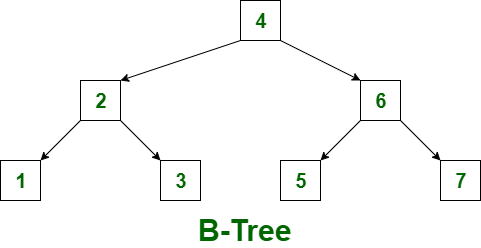
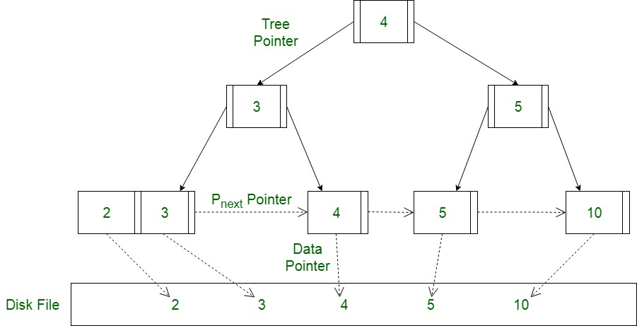

## 균형 트리

이진트리는 각 노드가 최대 두개의 자식 노드를 가지는 트리이다.

완전이진트리, 균형이진트리 등 여러 종류가 있는데, 이 중 균형이진트리는 트리의 높이를 균형적으로 유지시켜 logN 을 유지할 수 있게 도와준다. 

B, B+, B* 트리는 모두 **균형 트리(Balanced Tree)** 계열이다. 다만 하나의 노드에 많은 정보가 담기며 두 개 이상의 자식을 가질 수 있다.

- 루트에서 리프까지 **모든 경로 길이(높이)가 동일**하도록 유지한다.
- 탐색/삽입/삭제가 평균이 아니라 **항상 O(log N)** 수준으로 동작하도록 설계한다.
- 디스크/버퍼 관점에서 핵심은 “**한 번 I/O로 많은 키를 비교**”하는 것이다. 즉, **노드(페이지/블록) 하나에 가능한 많은 키를 담아 트리 높이를 낮추는 것**이 성능의 출발점이다.

여기서 DB 인덱스의 “노드”는 보통 디스크의 **페이지(page)/블록(block)** 단위로 관리된다.

---

## B-tree

모든 노드가 데이터를 가질 수 있는 균형 탐색 트리이다.

### 구조

B-트리는 한 노드에 여러 키를 저장하는 다진 트리이다.

- **브랜치 노드**: 키 + 자식 포인터를 가진다.
- **리프 노드**: 키 + (레코드 포인터 또는 값)을 가진다.

중요한 특징은 **브랜치 노드에도 ‘데이터(레코드 포인터/값)’가 들어갈 수 있다**는 점이다. 즉, 어떤 키는 리프까지 내려가지 않고 중간 노드에서 검색이 끝날 수도 있다.

### 장점

- 브랜치 노드에도 데이터가 있을 수 있어, 특정 경우에는 **리프까지 내려가지 않고** 검색이 끝날 가능성이 있다(이론적 장점).

### 단점(DB 인덱스 관점)

- 브랜치 노드가 데이터까지 담기 시작하면 브랜치 노드가 커져서 **fan-out(한 노드가 품는 자식 수)** 이 줄고, 그 결과 트리 높이가 커질 수 있다.
- 범위 검색(range scan)에서는 결국 리프를 순회해야 하는데, B-트리는 “리프들의 순차 연결”이 구조적으로 필수는 아니어서(구현에 따라 다름) DB 인덱스에 바로 최적 형태라고 보긴 어렵다.

> 현실적으로 상용 DB의 대표 인덱스는 “B-트리”라고 부르더라도, 실제 구현은 대부분 B+트리 계열인 경우가 많다. DB가 원하는 건 “점 검색도 빠르고, 범위 검색도 빠른” 구조이기 때문이다.

---

## B+tree

B+트리는 DB 인덱스에서 사실상 표준처럼 쓰이는 구조다. 데이터는 리프에만 있고, 리프는 연결 리스트로 구성된다.

### 구조

B+트리는 B-트리와 비슷해 보이지만, 아래와 같은 차이가 있다.

1) **브랜치 노드는 키와 자식 포인터만 가진다.**  
   브랜치 노드는 포인터 역할만 하며, 실제 레코드 주소(ROWID 등)나 값은 **리프에만** 존재한다.

2) **리프 노드들이 정렬 순서대로 연결(Linked List)된다.**  
   리프끼리 좌우 포인터로 이어져 있어 범위 스캔이 매우 효율적이다.

DB에서 B+트리를 선호하는 이유는 아래와 같다.

**(1) 트리 높이가 낮아진다.**  
브랜치 노드에 데이터가 없으니 같은 페이지 크기에서 더 많은 키를 담을 수 있다. 그 결과 fan-out이 증가하고 높이가 감소해 I/O가 줄어든다.

**(2) 범위 검색이 압도적으로 유리하다.**  
`WHERE key BETWEEN A AND B` 같은 범위 조건은 A가 있는 리프까지 한 번 내려간 뒤, 리프 연결을 따라 쭉 읽기만 하면 된다. 즉 아래로 내려가는 랜덤 I/O보다 옆으로 넘어가는 순차 접근에 가까워져 버퍼/프리페치에도 유리하다.

**(3) 동작이 예측 가능하다.**  
어떤 키든 결국 리프에 데이터가 있으니 점 검색도 “루트 -> 브랜치 -> 리프”로 일정한 패턴을 가진다.

### 삽입/삭제 시의 특징

삽입으로 리프가 꽉 차면 **페이지 split(분할)** 이 발생한다. 분할은 단순히 페이지가 하나 늘어나는 문제를 넘어서 인덱스 블록 증가, 상위 노드 키 갱신/전파, 리프의 물리적 연속성 저하, 동시성/래치 경합 증가 같은 비용으로 이어질 수 있다.

(삽입은 루트 -> 브랜치 -> 리프 로 내려가서 삽입할 위치를 찾고, 찾은 리프 엔트리에 삽입한다. 만약 리프가 분할해야 하면 브랜치에도 영향이 가며, 브랜치도 분할할 수도 있다. UPDATE 는 인덱스 키가 변경되면 DELETE + INSERT 와 동일하게 동작한다고 볼 수 있다.)

---

## B*tree

B*트리는 보통 **B+트리의 변형(개선형)** 으로 설명한다. 목표는 **페이지 분할을 줄이고 페이지 사용률(공간 효율)을 높이는 것**이다.

B+트리에서 삽입이 계속 일어나면 분할이 자주 발생하고 트리가 커지며, 리프의 논리적 순서와 물리적 배치가 어긋나 리프가 여기저기 흩어질 수 있다. 그 결과 범위 스캔 성능과 캐시 효율이 함께 떨어질 수 있다.

B+트리는 보통 꽉 차면 2개로 쪼갠다(2-way split)에 가깝다. 반면 B*트리는 먼저 형제 노드(좌/우)에 여유 공간이 있으면 **재분배(redistribution)** 로 분할을 미루고, 형제도 꽉 찼을 때만 분할을 수행한다. 이때도 단순 2-way split이 아니라 **3-way split** 형태로 재구성하여, 각 노드가 더 높은 최소 점유율을 유지하도록 유도한다.

### 장단점

- 장점: 분할 빈도 감소, 블록 사용률 증가로 인덱스 크기 완화에 도움된다.
- 단점: 재분배/3-way split 로직이 더 복잡하고, 형제 노드까지 함께 다루므로 갱신 범위가 커질 수 있다(동시성 영향은 구현체에 따라 다름).

---

## 요약

- **B-트리**: 브랜치 노드도 데이터(레코드 포인터/값)를 가질 수 있는 균형 트리
- **B+트리**: 데이터는 리프에만, 브랜치 노드는 디렉터리 역할, 리프는 연결되어 범위 검색에 강함
- **B*트리**: B+트리 기반이며 split을 줄이고 공간을 더 채우기 위해 형제 재분배/3-way split 등을 사용

---

## 튜닝

### 인덱스 스캔 효율화

범위 스캔이 많다면 B+트리의 리프 연결 구조 덕을 보지만, 인덱스가 커져 높이가 증가하거나(블록 수 증가), 분할이 누적되어 리프의 물리적 연속성이 깨지거나, 조건이 애매해져(선두 컬럼 미사용) 리프를 많이 훑게 되면 “리프를 옆으로 오래 걷는 비용”이 커진다. 즉 “트리 구조는 좋아도” 어떻게 스캔하느냐가 효율을 가른다.

### 랜덤 액세스 최소화

B+트리/B*트리는 리프에 **ROWID(또는 PK)** 같은 “테이블로 가는 주소”를 들고 있다. 인덱스에서 후보를 많이 뽑아놓고 테이블을 건건이 찍으면 랜덤 I/O가 증가한다. 그래서 튜닝은 보통 인덱스에서 필터링을 더 강하게 만들거나(조건/컬럼 구성 개선), 커버링 인덱스(필요 컬럼을 인덱스만으로 해결)를 활용하거나, 클러스터링/정렬/배치 접근으로 랜덤 I/O를 완화하는 방향으로 진행한다.
