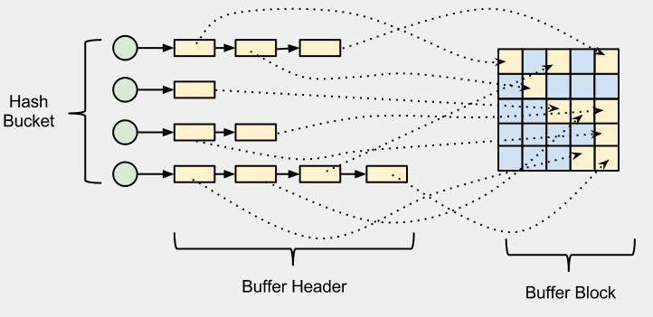
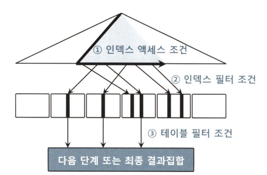
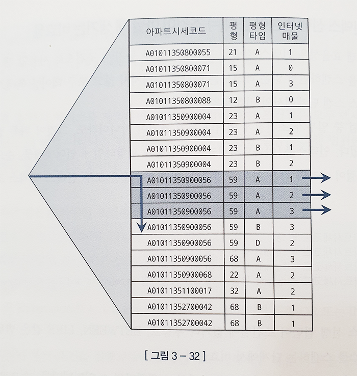
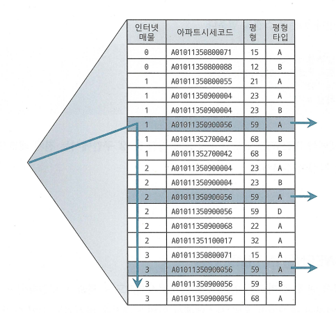
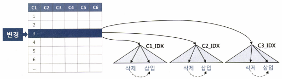

# 인덱스 튜닝
## 테이블 액세스 최소화

반복해서 말했듯이 SQL 튜닝은 랜덤IO 와의 전쟁이다.

### 테이블 랜덤 액세스

SQL 이 참조하는 컬럼을 인덱스가 모두 포함하는게 아니면 인덱스 스캔 후 반드시 테이블을 액세스 한다. "TABLE ACCESS BY INDEX ROWID" 라 표시된 부분이 여기에 해당한다.


인덱스를 스캔하는 이유는 검색 조건을 만족하는 소량의 데이터를 인덱스에서 빨리 찾고 거기서 테이블 레코드를 찾아가기 위한 주소값인 ROWID 를 얻기 위해서다. 여기서 말하는 ROWID 는 논리적 주소다.

보통 프로그래밍 언어에서 포인터는 메모리 주소값을 담는 변수이다. 메모리에 있는 데이터를 찾아가는 데 있어 포인터로 접근하는 것보다 빠른 방법은 없으며 비용은 O(0)에 가깝다. 물리적으로 직접 연결된 구조와 다름없다.

이 포인터를 생각하여 ROWID 를 이해하면 안된다. 이는 디스크 상에서 테이블 레코드를 찾아가기 위한 위치 정보를 담을 뿐이다.

#### 메인 메모리 DB 와 비교

메인 메모리 DB 는 데이터를 모두 메모리에 로드하고 메모리를 통해서만 IO 를 수행하는 DB 다. 보통 잘 튜닝된 OLTP 성 데이터베이스 시스템은 버퍼 캐시 히트율이 99% 이상이다. 디스크를 경유하지 않고 대부분 메모리에서 읽는다는 의미이다. 그럼에도 메인 메모리 DB 만큼 빠르진 않다.

메인 메모리 DB 는 인스턴스를 기동하면 디스크에 저장된 데이터를 버퍼캐시로 로딩하고 인덱스를 생성한다. 이 때, 인덱스는 오라클처럼 디스크 상의 주소정보를 갖는게 아닌, 메모리상의 주소정보인 포인터를 갖게되며, 오라클보다 훨씬 빠르다.

오라클은 테이블 블록이 수시로 버퍼캐시에서 밀려낫다가 다시 캐싱되며, 그때마다 다른 공간에 캐싱되므로 인덱스에서 포인터로 직접 연결할 수 없는 구조다. 메모리 주소 정보(포인터)가 아닌 디스크 주소 정보를 이용해 해시 알고리즘으로 버퍼 블록을 찾는다.


#### IO 메커니즘 복습
DBA(데이터파일번호 + 블록번호)는 디스크 상에서 블록을 찾기 위한 주소 정보다. 디스크에서 블록을 읽기 전 버퍼 캐시를 읽는다. 읽고자 하는 DBA 를 해시 함수에 입력해서 해시 체인을 찾고 거기서 버퍼 헤더를 찾는다.

캐시에 적재할 때와 읽을 때 같은 해시 함수를 사용하므로 버퍼 헤더는 항상 같은 해시 체인에 연결된다. 반면, 실제 데이터가 담긴 버퍼 블록은 매번 다른 위치에 캐싱되는데, 그 메모리 주소값을 버퍼 헤더가 가지고 있다. 즉, 해싱 알고리즘으로 버퍼 헤더를 찾고, 거기서 얻은 포인터로 버퍼 블록을 찾아간다.

인덱스로 테이블 블록을 접근할 땐 리프에서 읽을 ROWID 를 분해해 DBA 정보를 얻고, 테이블 풀스캔일 땐 익스텐트 맵을 통해 읽을 블록들의 DBA 정보를 얻는다.



모든 데이터가 버퍼 캐시에 캐싱되어 있어도 테이블 레코드를 찾기 위해 매번 DBA 해싱과 래치 획득 과정을 반복해야 한다. 동시 액세스가 심할 땐 캐시버퍼 체인 래치와 버퍼 락에 대한 경합도 발생한다. 이처럼 인덱스 ROWID 를 이용한 테이블 앵ㄱ세스는 생각보다 고비용이다.


### 인덱스 클러스터링 팩터 (CF, 군집성 계수)
CF 는 특정 컬럼을 기준으로 같은 값을 갖는 데이터가 서로 모여있는 정도를 의미한다. CF 가 좋은 컬럼에 생성한 인덱스는 검색 효율이 매우 좋다. 예를 들어, 거주지역 = 제주 에 해당하는 고객 데이터가 물리적으로 근접해있으면 흩어진것보다 데이터 찾는 속도가 빠르다.

CF 가 좋은 컬럼에 생성한 인덱스는 검색 효율이 좋다고 했는데, 이는 테이블 액세스량에 비해 블록 IO 가 적게 발생함을 의미한다. 앞서 인덱스 레코드마다 테이블 레코드를 건건이 블록 단위로 IO 한하면 CF 에 의한 블록 IO 발생량은 차이가 없어야 한다. 왜 이런 차이가 발생할까?

인덱스 ROWID 로 테이블을 접근할 떄 오라클은 래치 획득과 해시 체인 스캔 과정을 거쳐 어렵게 찾아간 테이블 블록에 대한 포인터를 바로 해제하지 않고 일단 유지하는데, 이를 버퍼 피닝이라 한다.

이 상태에서 다음 인덱스 레코드를 읽었는데, 직전과 같은 테이블 블록을 가리키면 래치 획득과 해시 체인 스캔 과정을 생략하고 바로 테이블 블록을 읽어 논리적인 블록 IO 과정을 생략할 수 있다. 즉, 같은 테이블 블록을 여러번 읽지 않아도 된다. 이 때문에 인덱스 레코드 정렬 순서와 테이블 레코드 정렬순서가 어느정도 일치하는 CF 가 좋은 컬럼이 성능이 좋다.


### 인덱스 손익분기점

인덱스의 테이블 접근 비용은 고비용이므로 읽어야 할 데이터가 일정량을 넘으면 테이블 풀 스캔보다 느리게 된다. 테이블 풀 스캔은 1000만건중 한건을 조회하든 10만건을 조회하든 성능이 일정하다. 

인덱스를 이용해 테이블에 접근할 땐 1000만건중 몇건을 추출하냐에 따라 성능이 크게 달라진다. 이유를 정리하면 다음과 같다.

- 테이블 풀 스캔: 시퀀셜 액세스, multiblock IO
- 인덱스 ROWID 를 이용한 테이블 접근: 랜덤 액세스, Single Block IO 

이에 의해 인덱스 손익분기점은 보통 5~20%에서 결정된다. 인덱스 CF 가 나쁘면 같은 테이블 블록을 여러번 반복해서 접근해야 하므로 논리적 IO 횟수가 늘고 물리적 IO 횟수도 늘게된다. 이 때문에 CF 가 나쁘면 손익분기는 5%미만에서 결정되며 BCHR 이 매우 안좋을 때는 1% 미만으로 낮아진다. 반대로 인위적으로 전체 데이터를 인덱스 컬럼 순으로 정렬해서 재입력해 CF 가 아주 좋을 땐 90%까지 올라가기도 한다.   

---
다만 위에서 언급한 5~20% 는 만아봐야 100만 이내의 테이블에 적용되는 수치다. 1000만건 수준으로 큰 테이블은 더 낮아진다.

예를 들어, 10만건 테이블에서 10%는 만건으로, 이정도면 버퍼캐시에서 데이터를 찾을 가능성이 있고, 인덱스 컬럼 기준으로 값이 같은 테이블 레코드가 근처에 모여 있을 가능성도 있다.

반면 1000만건일 경우 10%면 100만건으로, 버퍼캐시에서 찾을 가능성이 작아져 성능이 훨씬 더 느려진다. 버퍼캐시에 할당하는 메모리 크기가 점점 커지긴하지만, 요즘 기준으로 보통 수백만개 블록을 캐싱하는 수준이다. 특정 테이블을 인덱스로 100만건 이상 접근하면 캐시 히트율은 극히 낮아질 수 밖에 없다.

따라서 만건만 넘어도 시퀀셜 액세스와 멀티블록 IO 인 테이블 풀 스캔이 빠를 수 있다.

---

#### 온라인 vs 배치 튜닝

온라인 프로그램은 보통 소량 데이터를 읽고 갱신하므로 인덱스를 효과적으로 활용하는게 중요하며 조인도 대부분 NL 이다. NL 은 인덱스를 이용해 조인한다.

배치 프로그램은 항상 전체범위 처리 기준으로 튜닝해야한다. 즉, 처리대상 집합 중 일부를 빠르게 처리하는게 아닌, 전체를 빠르게 처리하는걸 목표로 해야 한다. 대량 데이터를 빠르게 처리하려면 인덱스와 NL 조인보단 풀스캔과 해시조인이 유리하다.

대량 배치에선 인덱스보다 풀스캔이 효율적이지만 초대량 테이블에서 풀스캔은 시스템에 부담도 주고 오래 기다려야 한다. 따라서 배치에서는 파티션 활용 전략이 매우 중요한 튜닝 요소이고 병렬처리까지 더할 수 있으면 좋다. 

**테이블을 파티셔닝 하는건 인덱스 성능보다 풀스캔을 빠르게 처리하기 위해서라는걸 기억하자.** 

### 인덱스 컬럼 추가
보통 테이블 접근을 줄이기 위해 가장 일반적으로 사용하는 튜닝 방식은 인덱스에 컬럼을 추가하는 것이다. (DEPTNO, JOB) 으로 구성한 인덱스가 있을 때 아래를 수행하면 deptno = 30 에 해당하는 모든 사원에 대해 테이블에 접근해야 한다.

```sql
select *
from emp
where deptno = 30
and   sal >= 2000
```

(DEPTNO, SAL) 로 인덱스를 변경하면 좋겟지만 운영에서는 해당 인덱스를 사용하고 있을 수 있어서 변경하기 어렵다. 새로 만든다면 한 테이블에 인덱스가 수십개씩 달려 인덱스 관리 비용이 증가함은 물론이고 DML 부하로 인해 트랜잭션 성능 저하가 생길 수 있다.

이럴 땐, (DEPTNO, JOB, SAL) 으로 SAL 컬럼만 추가하는 것으로 큰 효과를 얻을 수 있다. 인덱스 스캔량은 줄진 않지만 sal 을 인덱스로 확인할 수 있으므로 테이블 랜덤 액세스 횟수를 줄일 수 있기 때문이다.

### 인덱스만 읽고 처리
테이블 랜덤 액세스가 아무리 많아도 필터 조건에 의해 버려지는 레코드가 거의 없다면 위 처럼 인덱스에 컬럼을 추가하는 걸로는 성능 향상을 볼 수 없다.

아래 쿼리에서 (부서번호) 인덱스를 사용하면 인덱스에서 부서번호 LIKE 조건에 해당하는 데이터를 찾고 테이블을 접근한 후에 버리는 데이터가 하나도 없어 비효율은 없다. 비효율이 없어도 인덱스 스캔 과정에서 얻은 데이터가 많으면 그만큼 테이블 랜덤 액세스가 많아 성능이 느릴 수 밖에 없다.
```sql
select 부서번호, sum(수량)
from 판매집계
where 부서번호 like '12%'
group by 부서번호
```

쿼리나 인덱스 문제가 아니라 절대량이 많은거라 어쩔 수 없이 느린대로 사용해야 한다.

**다만, 위 처럼 쿼리에 컬럼이 많지 않다면 수량 컬럼만 인덱스에 추가하면 커버드 인덱스가 되어 테이블 액세스를 제거할 수 있어 성능을 획기적으로 개선할 수 있다.**

### 인덱스 구조 테이블

램덤 액세스가 아예 발생하지 않도록 테이블을 인덱스 구조로 생성하는 IOT(Index-Organized Table)이 있다.

테이블을 찾아가기 위한 ROWID 를 갖는 일반 인덱스와 달리 IOT 는 그 자리에 테이블 데이터를 갖는다. 즉, 테이블 블록에 있어야 할 데이터를 인덱스 리프 블록에 모두 저장하고 있다. 즉, 인덱스 리프 블록이 곧 데이터 블록이다.

테이블을 인덱스 구조로 만드는 구문은 아래와 같다.

```sql
create table index_org_t (a number, b varchar(10), constraint index_org_t_pk primary key(a))
organization index;
```

참고로 일반 테이블은 힙 구조 테이블이라 한다. 테이블 생성할 때 대개 생략하지만 아래처럼 organization 옵션을 명시할 수 있다.

```sql
create table index_org_t (a number, b varchar(10), constraint index_org_t_pk primary key(a))
organization heap;
```

일반 힙 구조 테이블에 데이터를 입력할 땐 랜덤 방식으로, Freelist 로부터 할당 받은 블록에 정해진 순서없이 데이터를 입력한다. 반면 IOT 는 인덱스 구조 테이블이므로 정렬 상태를 유지하며 데이터를 입력한다.

IOT 는 인위적으로 CF 를 좋게 만드는 방법 중 하나다. 같은 값을 가진 레코드가 항상 정렬된 상태이므로 랜덤 액세스가 아닌 시퀀셜 방식으로 데이터를 접근하여 between 이나 부등호 조건으로 넓은 범위를 읽을 때 유리하다.

데이터 입력과 조회 패턴이 다른 테이블에서도 유용하다. 예를 들어, 영업사원들의 일별 실적을 집계하는 테이블은 실적 등록은 일자별로 진행되지만 실적 조회는 주로 사원별로 이루어진다. 영업사원 100명, 한 블록에 100개의 레코드가 담겨 매일 한 블록씩 담긴다 하자.

```sql
select substr(일자, 1, 6) 월도,
       sum(판매금액) 총판매금액,
       avg(판매금액) 평균판매금액
from 영업실적
where 사번 = '123'
and   일자 between '20180101' and '20181231'
group by substr(일자, 1, 6)
```
위 쿼리에 인덱스를 이용하면 사원마다 랜덤 액세스 방식으로 365개 테이블 블록을 읽어야 하는데, CF 가 매우 안좋으므로 조회 건수만큼 블록IO 가 발생한다.

입력과 조회패턴이 다를 때 아래처럼 사번이 첫번째 정렬 기준이 되도록 IOT 를 구성하면 한 블록에 100개 레코드가 담기므로 네개 블록만 읽고 처리할 수 있다.

```sql
create table 영업실적(사번 varchar2(5), 일자 varchar2(8), ... primary eky(사번, 일자)) organization index;
```


### 클러스터 테이블

## 부분범위 처리 활용
### 부분범위 처리
DBMS 가 클라이언트에게 데이터를 전송할 때 일정량씩 나누어 전송한다. 전체 결과집합 중 아직 전송하지 않은 분량이 많이 있어도 서버 프로세스는 클라이언트로부터 추가 fetch call 을 받기 전까지 기다린다.

OLTP 에서 대량 데이터를 빠르게 다룰 수 있는 원리가 여기에 있다.

```kotlin
val stmt = con.createStatement()
val rs: ResultSet = stmt.executeQuery("select name from big_table")

(0..100).forEach {
    if(rs.next()) println(rs.getString(1))
}

rs.close()
stmt.close()
```

위 쿼리 조회 결과가 1억건이라도 빠르게 결과를 볼 수 있는 이유는 먼저 읽은 데이터를 일정량 전송하고 멈추기 때문이다. 서버 프로세스는 데이터 전송후에 CPU 를 os 에 반환하고 큐에서 기다리다, 다음 fetch call 을 받으면 큐에서 나와 다음 데이터를 일정량 읽어 전송하고 대기한다.

이렇게 전체 결과집합을 쉼없이 연속적으로 전송하지 않고 사용자가 fetch call 을 할때 일정량씩 나누어 전송하는걸 부분범위 처리라 한다.

이 단위는 array size 로 자바는 기본이 10이며, Statement 객체 setFetchSize 로 설정할 수 있다. 정리하면 아래와 같이 동작한다.

1. 최초 rs.next() 호출 시 fetch call 로 db 서버로부터 전송받은 데이터 10건을 클라이언트 캐시에 저장한다.
2. 이후 rs.next() 호출할 때 fetch call 을 발생시키지 않고 캐시에서 데이터를 읽는다.
3. 캐시에 저장한 데이터를 모두 소진한 상태에서 rs.next() 호출 시 추가 fetch call 을 통해 10건만 받는다.
4. 데이터를 다 읽을 때 까지 2~3을 반복한다.

즉, 쿼리 결과집합이 1억건이라도 버퍼캐시에 모두 적재하고 사용자에게 전송하는게 아닌, array size 만큼만 적재하게 된다.

다만 아래처럼 order by 가 있으면 서버는 모든 데이터를 다 읽어 created 순으로 정렬을 마치고 데이터를 전송하므로 전체범위처리가 된다. Sort area 와 temp 테이블스페이스까지 이용해 데이터 정렬을 마치고 나면 그때부터 일정량씩 나눠 클라이언트에 데이터를 전송한다.

```kotlin 
val stmt = con.createStatement()
val rs: ResultSet = stmt.executeQuery("select name from big_table order by created")
```

**만약 created 컬럼이 선두인 인덱스가 있으면 항상 정렬되어 있는 인덱스가 있으므로, 전체 데이터를 정령하지 않고도 정렬된 상태의 결과집합을 바로 전송할 수 있으므로 부분범위 처리가 가능하다.**

참고로 array size 를 용도에 맞게 설정해야 한다. 만약 대량 데이터를 파일로 내려받는다면 어차피 데이터를 모두 전송해야 하므로 Array size 를 크게 설정하여 fetch call 을 줄이는게 좋다. 반대로, 몇건만 조회한다면 작게 설정하는게 유리하다.

### OLTP 환경에서 부분범위 처리에 의한 성능개선 원리

OLTP 라고 항상 소량 데이터만 조회하는 건 아니다. 수만건을 조회하는 경우도 있는데, 인덱스를 이용해도 랜덤 액세스로 인해 성능을 내기 어렵다. 

다행히 OTLP 에서 쿼리 결과 집합이 많을 때 사용자가 모든 데이터를 일일이 다 확인하진 않는다. 은행계좌 입출금 조회, 뉴스 조회 등 특정한 정렬 순서로 상위 일부 데이터만 확인한다.  이 때 항상 정렬 상태를 유지하는 인덱스를 이용하면 정렬 작업을 생략하고 앞쪽 일부 데이터를 아주 빠르게 보여줄 수 있다.

인덱스와 부분범위 처리 원리를 잘 이용하면 OLTP 환경에서 극적인 성능개선 효과를 얻을 수 있는 원리가 여기에 있다.

```sql
select 게시글ID
from 게시판
where 게시판구분코드 = 'A'
order by 등록일시 desc
```

위에서 (게시판구분코드, 등록일시) 로 인덱스 선두 컬럼을 구성하지 않으면 소트 연산을 생략할 수 없다. A 조건을 만족하는 모든 레코드를 인덱스에서 읽어야하고 그만큼 많은 테이블 랜덤 액세스가 발생한다.
모든 데이터를 다 읽고 등록일시 역순으로 정렬을 마치고 출력을 시작하므로 OLTP 에서 요구되는 빠른 응답을 내기 어렵다.

**(게시판구분코드, 등록일시) 로 구성된 인덱스가 있으면 소트 연산이 생략되고, 부분범위 처리로 인해 전체 데이터에 대해 테이블 랜덤 액세스를 하지 않아도 되어 성능이 향상된다.**


### 배치 IO
디스크 랜덤 IO 성능을 개선하기 위해 많은 업체가 노력하는데, 최근 가장 좋은 개선은 배치 IO 다. 이는 읽는 블록마다 건건이 IO call 을 발생시키는 비효율을 줄이기 위한 기능이다. 인덱스를 이용해 테이블을 접근하다 버퍼 캐시에서 블록을 찾지 못하며 일반적으로 디스크 블록을 바로 읽는데,
이 기능이 작동하면 테이블 블록에 대한 디스크 IO call 을 미뤗다가 읽을 블록이 어느정도 쌓이면 한번에 처리한다.

12c 부터는 인덱스 ROWID 로 테이블을 접근하는 어떤 부분에서든 이 기능이 작동할 수 있다.

#### 데이터 정렬 이슈
배치 IO 기능이 작동하면 인덱스를 이용해서 출력하는 데이터 정렬 순서가 매번 다를 수 있다. 버퍼캐시 히트율이 100%라서 테이블 블록을 모두 버퍼 캐시에서 찾을때는 기존처럼 인덱스 키값 순으로 데이터가 출력되지만, 아닐 때 배치 IO 가 작동한다면 데이터 출력 순서가 인덱스 정렬 순과 다를 수 있다.

옵티마이저는 인덱스로 소트 연산을 생략할 수 없거나 order by 가 없으면 램덤 IO 성능을 향상하는 배치 IO 를 기본적으로 선택한다.

다만, 시스템 레벨에서 이를 비활성화하는 경우도 있다. SQL 에 order by 가 없으면 결과집합의 정렬 순서를 보장할 필요가 없으므로 옵티마이저가 배치 IO 를 선택해 출력된 결과집합의 정렬 순서가 매번 다를 수 있다. 이 경우, 필요한 order by 를 생략한 SQL 패턴에서 문제가 발생한다.

과거에는 인덱스를 이용하면 결과집합이 자동으로 인덱스 키값 순으로 정렬되므로 order by 를 생략하는 패턴을 사용하곤 했는데, 이런 경우 배치 IO 기능을 사용할 수 없다. 이런 경우 이런 패턴을 개선해야 되지 배치 IO 기능을 비활성화하는건 추천하지 않는다.  


# 인덱스 스캔 효율화

IOT, 클러스터, 파티션은 테이블 랜덤 액세스를 최소화하는 효율적인 저장구조지만 운영에서 이를 적용하기에는 검증이 필요하다. 운영 환경에서 가장 일반적인 튜닝 방법은 인덱스 컬럼 추가다.
테이블 랜덤 액세스 최소화가 쿼리 성능에 영향을 많이 미치는 것에 비해 튜닝 기법은 단순하다.

여기서는 인덱스 스캔 효율화를 위한 튜닝 방법을 알아본다.

## 인덱스 탐색

## 인덱스 스캔 효율성

인덱스 선행 컬럼이 조건절에 없으면 인덱스 리프 블록에서 스캔하는 레코드 수에 차이가 나 효율성에 차이가 난다.

### 인덱스 스캔 효율성 측정

## 액세스 조건과 필터 조건

인덱스 액세스 조건은 인덱스 스캔 범위를 결정하는 조건이다. 인덱스 수직적 탐색을 통해 스캔 시작점을 결정하는 데 영향을 미치고, 인덱스 리프 블록을 스캔하다가 어디서 멈출지를 결정하는 데 영향을 미치는 조건절이다.

인덱스 필터 조건은 테이블로 액세스할지 결정하는 조건절이다.



인덱스를 이용하든 테이블을 풀스캔하든 테이블 액세스 단계에서 처리되는 조건절은 모두 필터 조건이다. 테이블 필터 조건은 쿼리 수행 다음 단계로 전달하거나 최종 결과집합에 포함할지를 결정한다.

## 비교 연산자 종류와 컬럼 순서에 따른 군집성

인덱스는 같은 값을 갖는 레코드가 군집해 있다. 같은 값을 찾을 때 = 연산자를 이용하므로 인덱스 컬럼 앞쪽부터 누락없이 = 연산자로 조회하면 조건절을 만족하는 레코드는 모두 모여있다.
하나를 누락하거나 = 조건이 아닌 다른 연산자로 조회하면 조건절을 만족하는 레코드가 흩어진 상태가 된다.

아래에서 (c1, c2, c3, c4) 로 인덱스가 구성되어 있을 떄, c1, c3 까지 만족하는 인덱스는 모여있고 c4 조건까지 만족하는 레코드는 흩어지게 된다.

```sql
where c1 = 1
and c2 = 'a'
and c3 between a and b
and c4 = 'c'
```
**즉, 선행 컬럼이 모두 = 조건인 상태에서 첫번째 나타나는 범위검색 조건까지만 만족하는 인덱스 레코드는 모두 연속해서 모여있지만, 그 이하 조건까지 만족하는 레코드는 비교 연산자 종류에 상관없이 흩어진다.**

선행 컬럼이 모두 = 조건인 상태에서 첫번째 나타나는 범위검색 조건이 인덱스 스캔 범위를 결정한다. 아래에서 가장 선두 컬럼이 범위검색 조건이면, 그 조건이 스캔 범위를 결정하며, 이게 인덱스 액세스 조건이 된다. 나머지 인덱스 컬럼 조건은 모두 인덱스 필터 조건이다.

```sql
where c1 between 1 and 3
and c2 = 'a'
and c3 = 'b'
and c4 = 'c'
```

> 결국 인덱스 선행컬럼에 맞게 = 조건으로 조회하고 있는 조건절을 제외한 나머지는 인덱스 스캔 범위를 결정하는 데 아무런 영향을 주지못한다. 인덱스 액세스 조건이 된다.

## 인덱스 선행 컬럼이 = 조건이 아닐 때 생기는 비효율
**인덱스 스캔 효율성은 인덱스 컬럼을 조건절에 모두 = 조건으로 사용할 때 가장 좋다. 리프를 스캔하며 읽은 레코드는 하나도 걸리지 않고 모두 테이블 액세스로 이어지므로 인덱스 스캔 단계에서의 비효율은 전혀 없다.**

만약 인덱스 컬럼 중 일부가 조건절에 없거나 between 같은 조건이라도 이게 뒤쪽 컬럼일때는 비효율이 없다. (아파트시세코드, 평형, 평형타입, 인덱스매물) 로 인덱스가 구성될 때 아래 조건절은 모두 인덱스 액세스 조건으로 사용된다.

```sql
where 아파트시세코드 = :a
where 아파트시세코드 = :a and 평형 = :b
where 아파트시세코드 = :a and 평형 = :b and 평형타입 =:c
where 아파트시세코드 = :a and 평형 = :b and 평형타입 between :c and :d
```

인덱스 선행 컬럼이 조건절에 없거나 부등호, like 같은 범위검색 조건이면 인덱스 스캔 단계에서 비효율이 생긴다.
인덱스 구성이 (아파트시세코드, 평형, 평형타입, 인덱스매물) 일 때 아래 쿼리는 선행 컬럼이 모두 = 조건이고 마지막 컬럼이 between 이므로 비효율 없이 검색한다.

```sql
select *
from 매물아파트매매
where 아파트시세코드 = 'a123'
and 평형 = '59'
and 평형타입 = 'a'
and 인터넷매물 between 1 and 3
order by 입력일 desc
```




(인덱스매물, 아파트시세코드, 평형, 평형타입) 로 인덱스를 를 구성하면 인덱스 선두 컬럼인 인터넷매물 between 이기에 나머지 조건을 만족하는 레코드들이 인터넷매물 값 별로 뿔뿔이 흩어지게 된다.




## between 을 in-list 로 전환

범위검색 컬럼이 맨 뒤로 가도록 인덱스를 (아파트시세코드, 평형, 평형타입, 인덱스매물) 로 구성하면 좋지만 운영에서는 바꾸기 쉽지 않다. 이 때는 between 을 in-list 로 바꾸면 효과가 있다.

```sql
select *
from 매물아파트매매
where 아파트시세코드 = 'a123'
and 평형 = '59'
and 평형타입 = 'a'
and 인터넷매물 in (1, 2, 3)
order by 입력일 desc
```

위 처럼 구성하면 인덱스 수직적 탐색을 세번하는 방식으로 더 적게 스캔하게 된다.


인덱스를 세번 탐색하는건 아래 쿼리를 작성한 것과 같다.

```sql
select *
from 매물아파트매매
where 아파트시세코드 = 'a123'
and 평형 = '59'
and 평형타입 = 'a'
and 인터넷매물 = 1
order by 입력일 desc
union all
select *
from 매물아파트매매
where 아파트시세코드 = 'a123'
  and 평형 = '59'
  and 평형타입 = 'a'
  and 인터넷매물 = 2
order by 입력일 desc
union all
select *
from 매물아파트매매
where 아파트시세코드 = 'a123'
  and 평형 = '59'
  and 평형타입 = 'a'
  and 인터넷매물 = 3
order by 입력일 desc
```

in-list 수 만큼 union all 브랜치가 생성되고 각 브랜치마다 모든 컬럼을 = 조건으로 검색하므로 앞서 선두 컬럼에 between 을 사용할 때의 비효율은 사라진다.

in-list 수가 늘어날 수 있으면 이 방식은 곤란하다. 수직적 탐색이 많이 발생하면 between 으로 리프 블록을 많이 스캔하는 비효율보다 더 비효율적일 수 있다. 이때는 nl 방식의 조인이나 서브쿼리로 구현하면 된다.

between 조건 때문에 인덱스를 비효율적으로 스캔해도 블록 IO 측면에서는 대개 소량에 그치는 경우가 많다. 인덱스 리프에는 테이블 블록과 달리 매우 많은 레코드가 담기기 때문이다. 데이터 분포나 수직적 탐색 비용을 따져보고 바꿔야 한다.

## in 조건은 = 인가

in 조건은 = 과 다르다. 아래 쿼리에 대해 (상품ID, 고객번호)와 (고객번호, 상품ID) 로 설계했을 때 차이가 있을 수 있다.

```sql
select *
from _
where 고객번호 = :a
and 상품ID in (a11, b11, c11)
```

상품ID 가 선두 컬럼인 경우, in 조건을 = 조건으로 만들기 위해 반드시 in-list iterator 방식으로 풀려야 효과적이다. 고객번호가 선두 컬럼인 경우 상품ID 조건절은 in-list iterator 방식 또는 필터 조건으로 처리한다.
in 조건을 = 조건으로 만들기 위해, 즉 액세스 조건으로 만들기 위해 in-list 방식으로 푸는게 항상 효과적인지는 데이터 분포에 따라 다를 수 있다.

만약 (고객번호, 상품ID) 로 있을 때, 고객번호만 인덱스 액세스 조건으로 사용하려면 아래 힌트를 사용하면 된다. 1은 인덱스 첫 컬럼까지만 액세스 조건으로 사용하라는 의미다.
상품ID 까지 인덱스 액세스 조건으로 사용하려면 (a 고객가입상품_X1 2) 로 하여 상품ID 가 in-list 로 풀리면서 인덱스 액세스 조건으로 사용된다.
```sql
/*+ num_index_keys(a 고객가입별상품_X1 1) */ * 
select *
from _
where 고객번호 = :a
and 상품ID in (a11, b11, c11)
```

## between, like 스캔 범위 비교

**between, like 은 둘 다 범위검색 조건으로, 앞서 설명한 범위검색 조건을 사용할 때의 비효율이 똑같이 적용된다. 다만, 데이터 분포와 조건절 값에 따라 인덱스 스캔량이 다를 수 있다. 결론은 like 보다 between 이 더 낫다.** 

(판매월, 판매구분) 인덱스가 있고, 판매구분은 a, b 두개가 존재하고 각각 90%, 10% 비중을 차지한다.

```sql
where 판매월 between '201901' and '201912'
and 판매구분 = 'b'

where 판매월 like '2019%'
and 판매구분 = 'b'
```

첫 조건절은 판매월 = '201901', 판매구분 = 'b' 인 첫 레코드에서 스캔을 시작하시만, 두번째 조건절은 판매월 = '201901' 인 레코드에서 스캔을 시작한다.
왜냐면 like 검색을 할땐 201900 이 있는지도 확인을 해야되기 때문이다. 마찬가지로 스캔을 끝날때도 201913 과 같은 값도 읽어야 할 수도 있다.

## 다양한 옵션 조건 처리 방식의 장단점

### or 조건
옵션 조건 처리에 대해 아래처럼 or 을 사용할 수 있다.

```sql
select *
from 거래
where (:id is null or 고객ID = :id)
and 거래일자 between :dt1 and :dt2
```

이 방식은 옵티마이저에 의한 or expansion 쿼리 변환이 기본적으로 작동하지 않으므로 옵션 조건 컬럼을 선두에 두고 (고객ID, 거래일자) 순으로 인덱스를 구성해도 이를 사용할 수 없다는 데 있다. 따라서 인덱스 선두 컬럼에 대한 옵션 조건에 or 조건을 사용하면 안된다.

인덱스에 포함되지 않은 컬럼에 대한 옵션 조건은 어차피 테이블에서 필터링할 수밖에 없으므로 그럴 때는 or 조건을 사용해도 무방하다. 그래도 or 조건을 이용한 옵션 조건 처리는 가급적 사용하지 않아야 한다.
이 방식의 유일한 장점은 옵션 조건 컬럼이 null 허용 컬럼이라도 결과집합을 보장한다는 것뿐이다.

> 동적 쿼리로 하자.

### like/between 조건

1. 인덱스 선두 컬럼에 대한 옵션 조건을 like/between 연산자로 처리하면 안된다.
2. null 허용 컬럼에 대한 옵션 조건을 like/between 연산자로 처리하면 안된다.
    ```sql
    where 고객ID like '%'
    ```
   위 쿼리에서 고객ID 가 nullable 이고 실제 null 이 있으면 그 데이터는 결과집합에서 누락된다. between 조건도 컬럼 값이 null 인 데이터는 결과집합에 누락된다.
3. 숫자형이면서 인덱스 액세스 조건으로도 사용 가능한 컬럼에 대한 옵션 조건 처리는 like 로 하면 안된다.
4. like 를 옵션 조건에 사용할 때 컬럼 값 길이가 고정적이어야 한다.


### union all


# 인덱스 설계

## 인덱스 설계가 어려운 이유
인덱스는 많아지만 아래의 문제가 생겨 마음대로 생성할 수 없다.

1. DML 성능 저하( -> TPS 저하)
2. 데이터베이스 사이즈 증가
3. 데이터베이스 관리 및 운영 비용 상승

만약 하나의 테이블에 인덱스가 6개 있으면, 신규 데이터를 입력할 때마다 6개 인덱스에도 데이터를 입력해야 한다. 
테이블과 달리 인덱스는 정렬을 유지해야 하므로 수직적 탐색으로 입력할 블록을 찾아야 되고, 찾은 블록에 여유 공간이 없으면 인덱스 분할이 발생한다.



이는 데이터를 지울때도 일일이 찾아 지워줘야한다. 핵심 트랜잭션이 참조하는 테이블에 대한 DML 성능 저하는 TPS 저하로 이어진다. 인덱스가 많으면 디스크 공간을 낭비하고, 데이터베이스 사이즈가 커지는 만큼 백업, 복제, 재구성 등을 위한 비용도 상승한다.

인덱스 개수를 최소화하려면 기존 인덱스 구성을 변경함으로써 문제를 해결해야 하는데, 인덱스 변경에 따른 시스템 변경 영향도가 매우 커서 이도 쉽지 않다.
영향받는 쿼리를 모두 찾아 성능을 검증해야 하는데, 운영단계에서는 이게 어려운 일이다.

그나마 신규 인덱스 추가는 비교적 영향도가 적어, 기존 인덱스를 변경하여 해결할 수 있는 문제도 인덱스를 추가하여 문제를 해결하곤 하는데, 이러면 TPS 가 나빠진다.


## 인덱스 선택 기준

가장 일반적인 인덱스 스캔 방식은 인덱스 범위 스캔이고, 이를 위해선 인덱스 선두 컬럼을 조건절에 반드시 사용해야 한다.
즉, **결합 인덱스를 구성할 때 첫번째 기준은 조건절에 항상 사용하거나 자주 사용하는 컬럼을 선정하는 것이다.**

**두번쨰 기준은 이렇게 선정한 컬럼 중 = 조건으로 자주 조회하는 컬럼을 앞쪽에 두는 것이다.**

## 스캔 효율성 이외의 판단 기준

위는 인덱스 스캔 효율성이 판단 기준이다. 하지만 이 선택 기준만으로 인덱스를 설계하다보면 인덱스 수가 더 늘어날 수 있다. 그 외에 아래와 같은 것들도 고려해야 한다.

- 수행빈도
- 업무상 중요도
- 클러스터링 팩터
- 데이터량
- DML 부하
- 저장공간
- 인덱스 관리 비용

이 중 가장 중요한건 수행 빈도다. 자주 사용하는 쿼리일수록 앞의 공식을 통해 최적의 인덱스를 구성해야 한다.

수행빈도와 관해, NL 조인할 때 어느 쪽에서 자주 액세스 되는지도 중요한 판단 기준이다. NL 조인할 때 Outer 쪽에서 액세스하는 인덱스는 스캔 과정에 비효율이 있어도 큰 문제가 아닐 수 있다.


```sql
-- (거래일자, 거래구분코드)
/** leading(a) use_nl(b) */
select * 
from 거래 a, 상품 b
where a.거래구분코드 = 'AC'
and a.거래일자 between 20101010 and 20110101
and b.상품번호 = a.상품번호
and b.상품분류 = '가전'
```

위에서 leading(a) use_nl(b) 이므로 거래 테이블이 Outer 다. 거래 쪽 인덱스를 스캔하는 과정에 비효율이 있어도 NL 조인 원리상 비효율은 한번에 그친다. 불필요한 테이블 액세스는 발생하지 않으므로 아주 넓은 거래일자 구간으로 조회하는게 아니라면 성능도 나쁘진 않다.
별로 성능에 문제가 없다면 (거래구분코드, 거래일자) 로 굳이 인덱스를 만들지 않아도 된다.

다만, NL 에서 Inner 쪽 인덱스 스캔에 비효율이 있으면 성능에 문제가 있을 수 있다. 
아래에서 between 조건 컬럼이 인덱스 선두컬럼이므로 Outer 테이블로부터 액세스하는 횟수만큼 비효율적인 스캔을 반복한다.

```sql
-- (거래일자, 상품번호, 거래구분코드)
/** leading(b) use_nl(a) */
select *
from 거래 a, 상품 b
where a.거래구분코드 = 'AC'
  and a.거래일자 between 20101010 and 20110101
  and b.상품번호 = a.상품번호
  and b.상품분류 = '가전'
```

NL 조인 Inner 쪽 인덱스는 = 조건 컬럼을 선두에 두는 것이 중요하고, 될 수 있으면 테이블 액세스 없이 인덱스에서 필터링을 마치도록 구성해야 한다.

---
NL 조인은 두 테이블이 조인을 할 때, 드라이빙 테이블( Outer 테이블)에서 결합 조건에 일치하는 레코드를 내부 테이블(Inner Table)에서 조인하는 방식이다.

거래가 Outer 인 경우
1. 거래(a)에서 거래구분코드='AC' AND 거래일자 between ... 조건을 만족하는 행들을 먼저 읽는다.
2. 거래 행 1건을 꺼내면 그 행의 상품번호를 이용해
   상품(b)에서 상품번호 = :a.상품번호 로 인덱스 탐색 해서 후보를 찾고 찾은 행에 상품분류='가전'을 필터한다.
3. 다음 거래 행으로 넘어가서 2~3을 반복한다.

핵심은 상품(b)쪽 접근이 거래 결과 건수만큼 반복된다. 즉, 거래구분코드='AC' AND 거래일자 between ... 조건은 한번만 수행된다.

상품이 Outer 인 경우
1. 상품(b)에서 상품분류='가전'인 상품들을 먼저 읽는다.
2. 상품 1건을 꺼내서 그 상품의 상품번호를 이용해
   거래(a)에서 상품번호 = :b.상품번호, 거래구분코드='AC', 거래일자 between ...
   를 만족하는 거래를 찾는다.
3. 다음 상품으로 넘어가서 반복한다.

핵심은 거래(a)쪽 접근이 가전 상품 건수만큼 반복된다. 즉, 거래구분코드='AC' AND 거래일자 between ... 조건은 여러번 수행된다.

---

## 공식을 초월한 전략적 설계

조건절 패턴이 10개일 때 패턴마다 인덱스를 만들 순 없다. 열개 중 가장 핵심적인 액세스 경로 한두 개를 선택해서 최적 인덱스를 설계하고,
나머지 액세스 경로는 약간의 비효율로 목표 성능을 만족하는 수준으로 인덱스를 구성할 수 있어야 한다.

예를 들어, 가계약 테이블이 있다고 하자. 가계약 목록 조회 시, 아래 1번 컬럼 6개중 하나를 선택하고, 2번 컬럼 4개중 하나를 선택한다.

1. 취급부서, 취급지점, 취급자, 입력자, 대리점설계사, 대리점지사 
2. 청약일자, 보험개시일자, 보험종료일자, 데이터생성일시

이 때, 인덱스 스캔 효율을 위해 = 조건 컬럼을 앞에, between 을 뒤에 두면 6*4 로 24개 인덱스가 필요하게 된다.
아래는 일자/일시 조건을 선두에 두고 자주 사용하는 필터 조건을 모두 뒤에 추가하는 방식으로 구성한 인덱스다.

- (청약일자, 취급부서, 취급지점, 취급자, 입력자, 대리점설계사, 대리점지사)
- (보험개시일자, 취급부서, 취급지점, 취급자, 입력자, 대리점설계사, 대리점지사)
- (보험종료일자, 취급부서, 취급지점, 취급자, 입력자, 대리점설계사, 대리점지사)
- (데이터생성일시, 취급부서, 취급지점, 취급자, 입력자, 대리점설계사, 대리점지사)

이 설계의 포인트는 두개다. **일자 조회구간이 길지 않으면 인덱스 스캔 비효율이 성능에 미치는 영향이 크지않다. 그리고 인덱스 스캔 효율보다 테이블 액세스가 더 큰 부하요소라는 점이다.**

가계약은 주로 최근 3일 이내 데이터를 조회한다. 어쩌다 한달치를 조회할 순 있지만 불필요한 테이블 액세스는 전혀 발생하지 않도록 설계했으므로 인내할 수 있는 수준의 성능은 나온다.

그래도 between 조건 컬럼을 선두에 두고 설계하는 건 찜찜하지만 이유는 있다. 가계약 테이블을 다양한 패턴으로 조회하지만 그중 대부분은 입력자 =, 데이터생성일시 between 조건이기 떄문이다.
즉, 이 패턴에 최적의 스캔 효율을 제공하면 다른 패턴에 비효율이 있어도 크게 지장이 없다고 판단한 것이다.

이렇게 인덱스 수를 최소화하면 사용빈도가 높은 쿼리가 나왓을 때 (입력자, 데이터생성일시) 와 같은 인덱스를 추가할 여유가 생기게 된다.

## 소트 연산을 생략하기 위한 컬럼 추가

인덱스는 항상 정렬 상태를 유지하므로 group by, order by 에 필요한 소트 연산을 생략가능하다. 즉, 조건절에 사용하지 않는 컬럼이라도 소트 연산 생략을 위해 인덱스에 구성시켜 성능을 개선할 수 있다.

아래 쿼리에서 order by 절 순서대로 (청약일자, 입력자ID) 로 구성하면 소트연산을 생략가능하다. 성능을 조금 더 고려하면, = 조건절 컬럼은 order by 절에 없더라도 인덱스 구성에 포함할 수 있으므로 (청약일자, 취급지점ID, 입력자ID) 로 두어도 생략 가능하다.

```sql
select *
from 계약
where 취급지점ID = :id
and 청약일자 between :start and :end
and 입력일자 >= trunc(sysdate -3)
and 계약상태코드 in (:a, :b)
order by 청약일자, 입력자ID
```

반면 입력일자와 같이 = 이 아닌 조건절 컬럼은 (청약일자, 입력자ID, 입력일자, 계약상태코드) 와 같이 반드시 order by 보다 뒷쪽에 두어야한다.

위 처럼 해도 소트 연산은 줄일 수 있지만, 조건에 만족하는 데이터를 늦게 만나면 IO 가 많이 발생할 수도 있다.

I/O 를 최소화하면서도 소트 연산을 생략하려면 아래 공식을 이용해야 한다.

1. = 연산자로 사용한 조건절 컬럼 선정
2. order by 절에 기술한 컬럼 추가
3. = 연산자가 아닌 조건절 컬럼은 데이터 분포를 고려해 추가 여부 결정

이 공식에 따라 위 쿼리는 (취급지점ID, 청약일자, 입력자ID) 로 구성한다. 입력일자와 게약상태코드는 뒷쪽에 붙여도되고 없어도 된다. **만약 이 조건을 만족하는 데이터가 적으면 인덱스에 추가하여 랜덤 액세스를 줄이는게 좋다.**


### IN 조건은 = 이 아니다

아래 인덱스를 (거주지역, 혈액형, 연령) 으로 구성한다고 하자.

```sql
select *
from 고객
where 거주지역 = '서울'
and 혈액형 in ('A', 'O')
order by 연령
```

**IN 조건이 = 이 되려면 IN-List iterator 방식으로 풀려야 한다.** 이는 쿼리를 아래와 같이 실행한다는 의미이고, IN 조건이 = 이 되지만 union all 위아래 두 집합을 묶어 연령 순으로 정렬하는 문제가 남는다.

```sql
select *
from 고객
where 거주지역 = '서울'
and 혈액형 = 'A'
order by 연령
union all
select *
from 고객
where 거주지역 = '서울'
  and 혈액형 = 'O'
order by 연령
```

위의 order by 소트 연산을 생량하려면, 두 쿼리 결과집합이 연령 순으로 정렬돼야 한다. 이게 가능하려면 서울 거주자의 모든 a 형 고객이 o 형 고객보다 연령이 낮아야하는데 이는 불가능하다.
즉, 옵티마이저는 소트연산을 생략하지 않는다.

**소트 연산을 생략하려면 In 조건이 in-list iterator 방식으로 풀려선 안된다. 즉, in 조건절을 인덱스 액세스 조건으로 사용하면 안되고 필터 조건으로 사용해야 한다.**
따라서 (거주지역, 연령, 혈액형) 으로 구성해야한다.

> 정리하면, in 조건은 IN-List iterator 방식으로 풀일수도 있고, 아닐수도 있는데, IN-List iterator 방식으로 풀리면 소트 연산을 생략할 수 없으므로 비효율적이고, IN-List iterator 방식으로 안할 경우에는 범위검색이므로 order by 컬럼 뒷쪽에 위치시켜야 소트 연산이 생략가능하다.

## 결합 인덱스 선택도

**선택도는 전체 레코드 중 조건절에 의해 선택되는 레코드 비율로, 선택도 * 총 레코드 수가 카디널리티다.** 인덱스 선텍도는 인덱스 컬럼을 모두 = 로 조회할 때 평균적으로 선택되는 비율이다.
선택도(카디널리티)가 높은 인덱스는 있어봣자 테이블 액세스가 많이 발생하므로 효과가 없다.

### 컬럼 순서 결정 시 선택도 이슈

아래 쿼리에서 고객번호와 성별 중 어떤 컬럼이 앞에 오든 둘다 인덱스 액세스 조건이므로 인덱스 스캔 효율에 전혀 차이가 없다.

```sql
where 성별 = :g
and 고객변호 = :num
```

**결합 인덱스를 구성할 땐 항상 사용하는 컬럼을 앞에 두고 그 중 = 조건을 앞쪽에 위치시키는 것만 신경쓰면된다.** 선택도가 낮은 컬럼을 앞에 두는거는 의미 없다.

## 중복 인덱스 제거

아래 세 인덱스는 완전 중복이므로 세번째 인덱스만 있어도 된다.

- 계약ID + 청약일자
- 계약ID + 청약일자 + 보험개시일자
- 계약ID + 청약일자 + 보험개시일자 + 보험종료일자

아래 처럼 된 인덱스도 계약ID 의 카디널리티가 매우 낮다면 사실상 중복이댜. 계약ID 평균 카디널리티가 5라면 = 조회 시 다섯건만 조회되는데, 다른 컬럼이 인덱스로 굳이 있을 필요는 없다.
이럴땐 (계약ID, 청약일자, 보험개시일자, ...) 와 같이 하나만 있어도 되고, 이를 불완전 중복이라 한다.

- 계약ID + 청약일자
- 계약ID + 보험개시일자
- ...


# 참고
- https://codeforest-document.tistory.com/22
- https://velog.io/@wooncloud/%EC%9D%B8%EB%8D%B1%EC%8A%A4-%EC%84%A4%EA%B3%84
- https://wooncloud.tistory.com/106