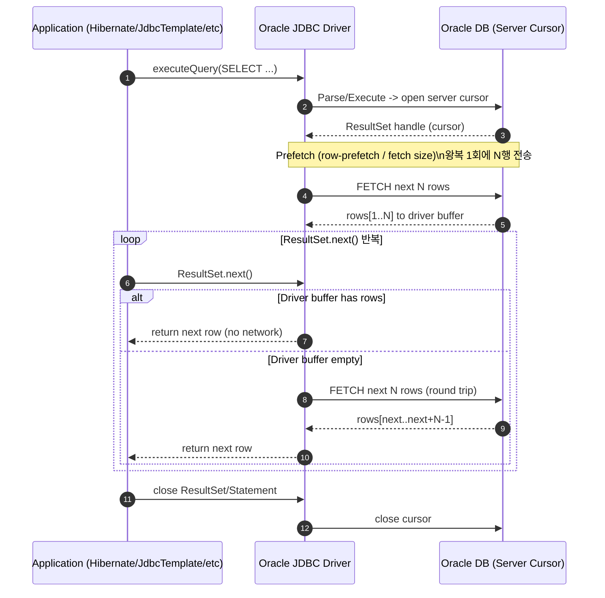
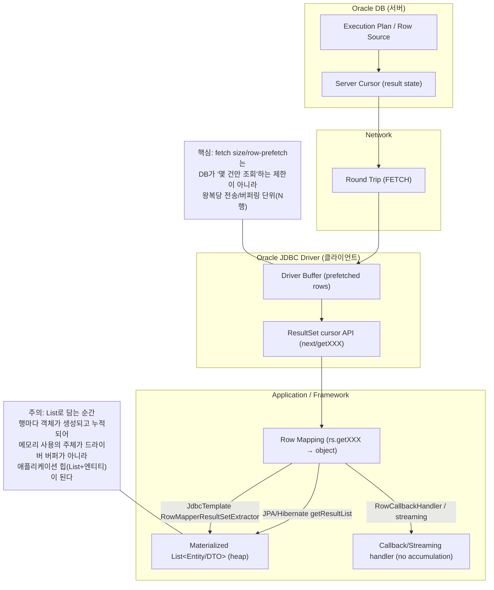

오라클 기준으로 보면, JDBC array size(보통 fetch size / row prefetch)는 결과를 몇 건만 조회할지를 정하는 스펙이 아니다. 
이 값은 한 번의 왕복(round trip) 에서 결과를 몇 행씩 미리 가져와 클라이언트 버퍼에 쌓아둘지를 정하는 값이다.

오라클 JDBC 는 기본적으로 커서 기반으로 결과를 읽으며, 기본적으로 10행씩 가져오는 동작이 기본값으로 알려져 있고, 이 기본값은 row-prefetch(defaultRowPrefetch)라는 개념으로 설명한다. 
오라클 문서에 기본적으로 커서에서 10행씩 받는다(기본 row-prefetch)라 명시되어 있고, row-prefetch 값을 바꾸면 커서로부터 각 왕복마다 받아오는 행 수가 바뀐다고 한다.
오라클 JDBC 는 커넥션 속성으로 defaultRowPrefetch 키 혹은 OracleConnection#setDefaultRowPrefetch 로 설정할 수 있다.

> JDBC 표준의 setFetchSize(n)는 힌트 성격이라 드라이버가 무시/조정할 여지도 있다.

오라클에서 `SELECT * FROM member` 같은 쿼리를 실행하면 결과 전체를 만들어서 한 번에 던져주는게 아니라, 서버 쪽에 실행 상태를 가진 커서(서버 커서)가 생성된다. 
클라이언트(JDBC)는 이 커서를 앞으로 전진시키면서(fetch) 결과 행을 받아온다. 애플리케이션 코드에서 ResultSet.next()를 호출한다는 건, 개념적으로 커서에서 다음 행을 달라는 요청을 반복하는 것과 같다. 
다만 이때의 next()는 호출 1번당 네트워크 왕복 1번이 아니라, 드라이버 버퍼에 프리페치된 행이 남아 있으면 그걸 즉시 꺼내 주고, 버퍼가 고갈되면 그 시점에 커서로부터 다음 배치를 가져오는 왕복이 발생하는 모델이다. 이게 row-prefetch/fetch size 가 가지는 의미이다.

여기서 array size = 100이라고 하면, DB 가 100건만 조회하고 끝내는게 아니다. 드라이버가 next()를 100번 호출할 때마다 서버에 매번 왕복하지 않도록, 서버 커서로부터 다음 행들을 미리 묶어서 받아 드라이버 내부 버퍼에 저장한다. 그 다음부터는 next() 호출이 올 때마다 버퍼에서 한 행씩 꺼내 반환한다. 
버퍼가 소진되면, 그 다음 next() 시점에 드라이버가 다시 서버로 왕복해서 다음 100행을 추가로 fetch 해 버퍼를 채운다. 즉, array size 는 전송/버퍼링 단위다.

따라서 DBMS 는 몇 행까지 읽었냐는 질문은 커서 관점에서 답해야 한다. 첫 fetch 에서 100행을 프리페치했다면, 애플리케이션이 아직 20행만 처리했더라도 서버 커서는 이미 100행까지 진행했을 수 있다.
다만 애플리케이션 메모리에 올라와 대기 중인 행은 보통 드라이버 버퍼(남은 80행)와 현재 처리 중인 행 정도다. 이 구조 때문에 결과가 커도 애플리케이션이 한 번에 전부를 객체로 만들지 않는 것이 가능해진다.

JPA 나 Querydsl 을 사용해 `memberRepository.findAll()` 처럼 `List<Member>` 를 받는 경우에도, 내부에서는 결국 JDBC 가 제공하는 ResultSet 을 순회하며 행을 읽고 엔티티를 만들어 리스트에 담는다. 
차이는 개발자가 `rs.next()` 를 직접 작성하지 않는다는 점뿐이다. 

예를 들어 Hibernate 쪽에는 결과를 읽어 List 에 추가하는 루프가 있고, `rowProcessingState.next()`를 돌면서 `results.add(...)`를 수행한다. 
즉 next 로 한 행씩 전진 → 읽기 → List 에 담기 라는 과정은 동일하다.

Querydsl 도 최종적으로는 JPA Query 를 만들고 `getResultList()`로 결과를 받아 List 를 리턴하는 구조라, List 를 리턴하는 순간 전체를 담는다. 
(Querydsl JPA 의 AbstractJPAQuery#fetch()가 createQuery() 후 getResultList(...)로 끝나는 흐름이 그대로 보인다.)

반대로 JdbcTemplate.query(...)는 RowMapper 를 주면 rs.next() 루프를 내부에서 돌며 리스트를 만들어주고, RowCallbackHandler 같은 방식을 쓰면 한 행씩 콜백으로 받아 처리하면서 누적을 피할 수 있다. 
즉, ResultSet 으로 처리하는건 동일하다.

## 참고
[Oracle JDBC: 기본 10행 row-prefetch, fetch size / round trip 설명]
- Fetch Size (기본 10행, row-prefetch): https://docs.oracle.com/cd/A97335_02/apps.102/a83724/resltse5.htm
- Oracle Row Prefetching (round trip 줄이기): https://docs.oracle.com/cd/A97335_02/apps.102/a83724/oraperf2.htm
- defaultRowPrefetch 속성 = setDefaultRowPrefetch: https://docs.oracle.com/en/database/oracle/oracle-database/21/jjdbc/data-sources-and-URLs.html

[Spring JDBC: JdbcTemplate이 루프를 숨긴다(코드/Extractor)]
- JdbcTemplate 소스: https://github.com/spring-projects/spring-framework/blob/main/spring-jdbc/src/main/java/org/springframework/jdbc/core/JdbcTemplate.java
- RowMapperResultSetExtractor API(각 row를 List에 추가): https://docs.spring.io/spring-framework/docs/current/javadoc-api/org/springframework/jdbc/core/RowMapperResultSetExtractor.html
- RowMapperResultSetExtractor 소스: https://github.com/spring-projects/spring-framework/blob/master/spring-jdbc/src/main/java/org/springframework/jdbc/core/RowMapperResultSetExtractor.java
  (while (rs.next()) … results.add(…))
- JdbcTemplate API(공식 Javadoc): https://docs.spring.io/spring-framework/docs/current/javadoc-api/org/springframework/jdbc/core/JdbcTemplate.html

[Hibernate ORM: next로 List에 담는 코드]
- OutputsImpl 소스(while rowProcessingState.next() … results.add …): https://github.com/hibernate/hibernate-orm/blob/master/hibernate-core/src/main/java/org/hibernate/result/internal/OutputsImpl.java

[Querydsl JPA: fetch() → createQuery() → getResultList()]
- AbstractJPAQuery 소스: https://github.com/querydsl/querydsl/blob/master/querydsl-jpa/src/main/java/com/querydsl/jpa/impl/AbstractJPAQuery.java
