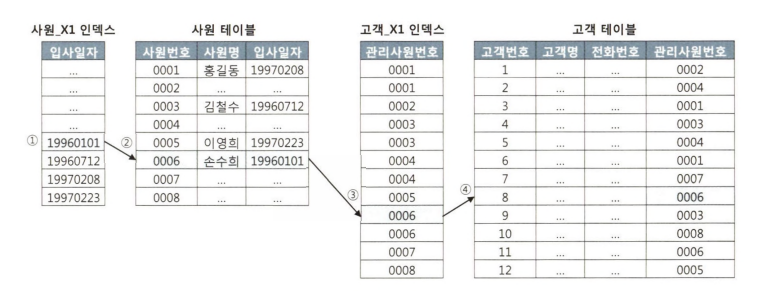
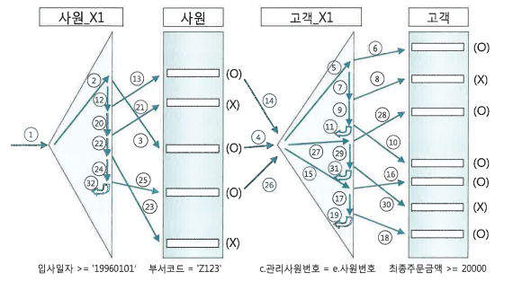
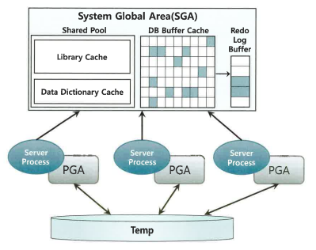
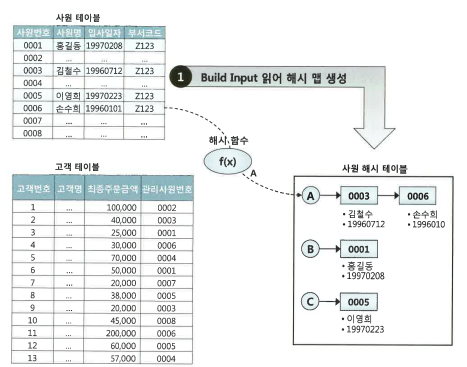
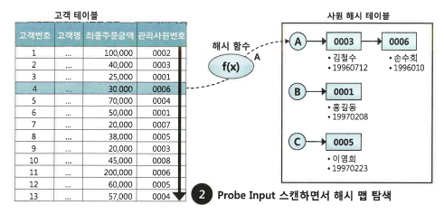

# NL 조인

조인의 기본은 NL 조인이다.

## 기본 메커니즘

아래 쿼리가 실제로 동작하는 알고리즘을 생각해보면,

```sql
select *
from 사원 e, 고객 c
where e.입사일 >= '19960101'
and c.관리사원번호 = e.사원번호
```

가장 쉬운 방식은 사원 테이블에서 1996년 1월 1일 이후 입사한 사원을 찾아, 각 사원마다 고객 테이블에서 사원번호가 일치하는 레코드를 찾는 방법이다. 이게 Nested Loop 조인이 사용하는 알고리즘이다.

아래는 중첩 루프문을 사용하는 PL/SQL 코드로, NL 조인이 어떤 순서로 데이터를 액세스하는지 잘 보여준다.
```sql
begin
    for outer in (select * from 사원 where >= '19960101')
    loop
        for inner in (select * from 고객 where 관리사원번호 = outer.사원번호)
        loop
            ...
        end loop;
    end loop;
end;
``` 

NL 조인은 보통 Outer 와 inner 양쪽 테이블 모두 인덱스를 이용한다. Outer 쪽은 한번만 수행하므로 테이블이 크지 않으면 테이블 풀 스캔을 이용할 수도 있지만, inner 쪽을 테이블 풀 스캔하게 되면 루프 만큼 **테이블 풀 스캔**을 수행하기 때문에 인덱스를 이용해야 한다.

자세한 과정은 아래와 같다.



1. 사원 인덱스에서 입사일자 >= 19960101 인 첫 레코드 검색
2. 인덱스 ROWID 로 사원 테이블 레코드 검색
3. 사원 테이블 레코드에서 읽은 사원번호로 고객 인덱스 검색
4. 인덱스 ROWID 로 고객 테이블 레코드 검색

3번 인덱스에서 0006에 해당하는 모든 레코드에 대해 고객 테이블을 찾은 후, 2~4번을 다시 반복하게 된다.


## NL 조인 실행계획 제어
아래sms 사원 테이블(Driving, Outer table) 기준으로 고객 테이블(inner)과 NL 방식으로 조인하라는 의미이다.

```sql
select /** ordered use_nl(c) */ 
    *
from 사원 e, 고객 c
where e.입사일 >= '19960101'
and c.관리사원번호 = e.사원번호
```

use_nl 은 NL 조인 힌트, ordered 힌트는 FROM 절에 기술한 순서대로 조인하라고 옵티마이저에게 지시할 때 사용한다.

아래는 네 테이블은 NL 방식으로 조인하되 옵티마이저가 스스로 순서를 정하게 된다.
```sql
select /** use_nl(A,B,C,D) */
```


## NL 조인 수행 과정 분석
- 사원PK: 사원번호
- 사원X1: 입사일자
- 고객PK: 고객번호
- 고객X1: 관리사원번호
- 고객X2: 최종주문금액

인덱스 구성이 위와 같을 때 아래 쿼리에서 조건절은 2 -> 3 -> 1 -> 4 순으로 수행된다.

```sql
SELECT /*+ ordered use_nl(c) index(e) index(c) */
    e.사원번호, e.사원명, e.입사일자, c.고객명, c.전화번호, c.고객번호, c.최종주문금액
FROM 사원 e, 고객 c
WHERE c.관리사원번호 = e.사원번호  -- 1
AND e.입사일자 >= '19960101'    -- 2
AND e.부서코드 = 'Z123'         -- 3
AND c.최종주문금액 >= 20000      -- 4
```



1. 입사일자 조건을 만족하는 레코드를 찾기위해 사원X1 인덱스 범위 스캔
2. ROWID 로 테이블에 접근해 부서코드 필터 조건을 만족하는 레코드 검색
3. 사원테이블에서 읽은 사원번호로 조인조건을 만족하는 고객 레코드를 찾기 위해 고객X1 을 범위스캔
4. ROWID 로 고객 테이블에 접근해 최종주문금액 필터조건을 만족하는 레코드 검색

## NL 조인 튜닝 포인트

위 예시에서 튜닝해야할 수도 있는 부분은 아래와 같다.

1. 단일 컬럼 인덱스를 >= 조건으로 스캔했으니 비효율 없이 6건 읽엇고, 이만큼만 테이블 램덤 액세스가 발생하지만, 많은 양의 랜덤 액세스가 발생하고 테이블에서 부서코드 조건에 의해 필터링 되는 비율이 높다면?
    - 사원X1 인덱스에 부서코드 컬럼을 추가하는 방안을 고려해야 한다.
2. 고객X1 인덱스를 탐색하는 횟수(조인 액세스 횟수)가 많을수록 성능은 느리다. 이는 Outer 테이블인 사원을 읽고 필터링한 결과 건수에 의해 결정된다. 만약 부서코드 조건을 만족하는 레코드가 10만건이고 고객X1 인덱스 깊이가 3이면 수직적 탐색에서만 30만개 블록을 읽어야 한다.
3. 최종주문금액 조건에 의해 필터링되는 비율이 높으면 고객X1 인덱스에 최종주문금액 컬럼을 추가하는 방안을 고려해야 한다.
4. 전체 액세스 수는 맨처음 액세스하는 사원X1 인덱스에서 얻은 결과 건수에 의해 좌우된다. 여기서 추출되는 레코드가 많으면 사원 테이블로 랜덤 액세스 횟수, 고객 인덱스 탐색 횟수 등 전반적으로 많아진다.

NL 조인 성능이 안나올 때, 위 처럼 랜덤 액세스 발생량을 줄이거나 더 효과적인 인덱스를 선택할 수 없을 경우 NL 대신 소트 머지 조인이나 해시 조인을 검토해야 한다.

## NL 조인 특징 요약

1. 램덤 액세스 위주의 조인 방식이다. 레코드 하나를 읽기위해 블록 통째로 읽는 램덤 엑세스 방식은 메모리 버퍼에서 빠르게 읽더라도 비효율은 있다.
인덱스 구성이 아무리 완벽해도 대량 데이터 조인에는 불리하다.

2. 조인을 한 레코드씩 순차적으로 진행한다. 1번 때문에 대량 데이터 처리 시 치명적인 한계가 있지만, 2번 특징으로 **아무리 큰 테이블을 조인하더라도 매우 빠르게 응답한다.**
    **부분범위 처리를 활용하면 NL 조인을 사용한 쿼리는 사용자가 조회버튼을 누르자마자 결과집합을 출력하기 시작한다.**
3. 다른 조인과 비교해, 인덱스 구성 전략이 특히 중요하다. 조인 컬럼에 대한 인덱스가 있냐 없냐, 컬럼은 어떻게 구성됐느냐에 따라 효율이 크게 달라진다.

이로 인해, 소량 데이터를 주로 처리하거나 부분범위 처리가 가능한 OLTP 시스템에 적합한 조인 방식이다.


## NL 조인 튜닝 실습

과정만 요약

1. 실행계획 확인 시, 사원X1 인덱스 스캔 후 사원 테이블을 액세스한 횟수가 2780인데 테이블에서 부서코드 조건을 필터링한 결과는 세건이다.
   - 불필요하게 테이블 램덤 액세스를 많이 하므로 사원X1 에 부서코드 컬럼 추가
2. 사원X1 인덱스는 (입사일자, 부서코드)로, 인덱스 선두 컬럼이 부등호로 조회한다. 사원X1 인덱스로부터 읽은 블록이 102개로, 한 블록에 평균 500개 레코드가 있다면 인덱스에서 세건을 얻기 위해 50000개 레코드를 읽는다.
   - cr: 블록 요청 횟수, pr: 디스크에서 읽은 블록 수, pw: 디스크에 쓴 블록 수
   - 사원X1 인덱스를 (부서코드, 입사일자) 로 구성(영향도 분석 필요)

## NL 조인 확장 메커니즘
오라클은 읽는 블록마다 건건이 IO call 을 발생시키는 비효율을 줄여 NL 조인 성능을 높이기 위해 테이블 Prefetch, 배치 IO 기능을 도입했다.

테이블 Prefetch 는 인덱스를 이용해 테이블을 액세스하다가 디스크 IO 가 필요하면, 이어서 곧 읽게 될 블록까지 미리 읽어서 버퍼캐시에 적재하는 기능이다.

배치 IO 는 디스크 IO call 을 미뤗다가 읽을 블록이 일정량 쌓이면 한꺼번에 처리하는 기능이다.


```
# 일반적인 경우
NESTED LOOPS
	TABLE ACCESS (BY INDEX ROWID) OF '사원'
		INDEX(RANGE SCAN) OF '사원_X1'
	TABLE ACCESS (BY INDEX ROWID) OF '고객'
		INDEX(RANGE SCAN) OF '고객_X1'

# 테이블 프리페치
TABLE ACCESS BY INDEX ROWID OF 고객
	NESTED LOOPS
		TABLE ACCESS BY INDEX ROWID OF 사원
			INDEX RANGE SCAN OF 사원_X1
		INDEX RANGE SCAN OF 고객_X1

# 배치 IO
NESTED LOOPS
	NESTED LOOPS
		TABLE ACCESS BY INDEX ROWID OF 사원
			INDEX RANGE SCAN OF 사원_X1
		INDEX RANGE SCAN OF 고객_X1
	TABLE ACCESS BY INDEX ROWID OF 고객
```

오라클에서는 위 세 실행계획이 모두 나타나는데, inner 쪽 테이블 블록을 모두 버퍼캐시에서 읽는다면 어떤 방식으로 수행하든 성능이나 데이터 출력 순서에 차이가 없다.
다만, 일부를 디스크에서 읽으면 성능에 차이가 있고, 배치 IO 실행계획이 나타날 떄는 결과집합의 정렬 순서도 다를 수 있다.


## 자가 진단
아래 쿼리에서 PRA_HST_STC 테이블에 (SALE_ORG_ID, STRD_GRP_ID, STRD_ID, STC_DT) 로 인덱스 구성을 하는게 의미 있을까?

```sql
select *
FROM PRA_HST_STC a, ODM_TRMS b
WHERE
    a.SALE_ORG_ID = :sale_org_id
  AND a.STRD_GR_ID = b.STRD_GRP_ID
  AND a.STRD_ID = b.STRD_ID
  AND b.TRMS_DT = :trms_dt
ORDER BY a.STC_DT desc
```

위 쿼리의 중요한 부분은 아래와 같다.

1. a.SALE_ORG_ID 기반으로 필터링
2. 나머지 컬럼은 ODM_TRMS 인덱스를 통해 수행

즉, PRA_HST_STC 테이블의 인덱스에 필요한 컬럼은 (SALE_ORG_ID, STC_DT) 이고, 나머지 컬럼은 ODM_TRMS 의 인덱스로 구성되어야 할것같다.

outer 테이블을 위한 조건이 아닌 경우 inner 테이블 기준으로 작성하는게 어떤 컬럼에 인덱스를 추가해야하는지 보기 편하다.  
```sql
select *
FROM PRA_HST_STC a, ODM_TRMS b
WHERE
    a.SALE_ORG_ID = :sale_org_id
  AND b.STRD_GRP_ID = a.STRD_GR_ID
  AND b.STRD_ID = a.STRD_ID
  AND b.TRMS_DT = :trms_dt
ORDER BY a.STC_DT desc
```


# 소트 머지 조인

조인 컬럼에 인덱스가 없을 때, 대량 데이터 조인이어서 인덱스가 효과적이지 않을 떄 옵티마이저는 NL 조인 대신 소트 머지 조인이나 해시 조인을 택한다.

## SGA, PGA

SGA 는 공유 메모리 영역으로 여기에 캐시된 데이터를 여러 프로세스가 공유할 수 있다. 다만, 동시에 액세스할 순 없고, 각 프로세스 간 액세스를 직렬화하기 위한 락 메커니즘으로 래치가 존재한다.

오라클 서버 프로세스는 sga 에 공유된 데이터를 읽고 쓰면서 동시에 자신만의 고유 메모리 영역을  갖는다. 각 오라클 서버 프로세스에 할당된 메모리 영역을 PGA 라 하고, 프로세스에 종속적인 데이터를 저장하는 용도로 활용한다.
할당받은 PGA 공간이 작아 데이터를 모두 저장하지 못하면 Temp 테이블스페이스를 이용한다.



즉, PGA 는 독립된 메모리이므로 래치와 같은 메커니즘이 불필요하고, 같은 양의 데이터를 읽더라도 SGA 버퍼캐시에서 읽는 것보다 빠르다.

## 기본 메커니즘

소트 머지 조인은 양쪽 집합을 조인 컬럼 기준으로 정렬하고, 정렬한 양쪽 집합을 서로 머지한다.

소트 머지 조인은 use_merge 힌트로 유도하며, 아래에서는 사원 테이블 기준으로 고객 테이블과 조인할 때 소트 머지 조인을 사용하라 유도한다.

```sql
SELECT /*+ ordered use_merge(c) */
    e.사원번호, e.사원명, e.입사일자, c.고객명, c.전화번호, c.고객번호, c.최종주문금액
FROM 사원 e, 고객 c
WHERE c.관리사원번호 = e.사원번호
AND e.입사일자 >= '19960101'  
AND e.부서코드 = 'Z123'       
AND c.최종주문금액 >= 20000    
```

1. 아래 조건에 해당하는 사원 데이터를 읽어 조인컬럼인 사원번호 순으로 정렬한다. 정렬한 결과집합은 PGA 영역에 할당된 Sort Area 에 저장하고, 꽉 차있으면 Temp 테이블스페이스에 저장한다.
    ```sql
     select 사원번호, 사원명, 입사일자
       from 사원
       where 입사일자 >= '19960101'
       and 부서코드 = 'Z123'
       order by 사원번호
    ```
2. 아래 조건에 해당하는 고객 데이터를 읽어 조인컬럼인 관리사원번호 순으로 정렬한다. 정렬한 결과집합은 PGA 영역에 할당된 Sort Area 에 저장한다.
    ```sql
    select * 
    from 고객 c
    where 최종주문금액 >= 20000
    order by 관리사원번호
    ```
3. PGA 에 저장한 사원 데이터를 스캔하면서 PGA 에 저장한 고객 데이터와 조인한다. 코드로 표현하면 아래와 같다.
    ```sql
    begin 
        for outer in (select * from pga 에 정렬된 사원)[]()
        loop 
             for inner in (select * from pga 에 정렬된 고객 where 관리사원번호 = outer.사원번호)
             loop
                 ...
             end loop;
         end loop;
     endl
    ```

1, 2는 소트 단계, 3은 머지단계이다. 실제 조인 연산을 하는 머지 단계는 NL 조인과 다르지 않다.
다만, 사원 데이터를 기준으로 고객 데이터를 매번 풀 스캔 하지 않는다. 고객 데이터가 정렬돼 있으므로 조인 대상 레코드가 시작되는 지점을 쉽게 찾을 수 있고, 조인에 실패하는 레코드를 만나는 순간 바로 멈출 수 있다.

<그림>

**sort area 에 저장한 데이터 자체가 인덱스 역햘을 하므로 소트머지조인은 조인 컬럼에 인덱스가 없어도 사용할 수 있다.**

## 소트 머지 조인이 빠른 이유

NL 조인은 모든 디비가 공통으로 제공하는 조인 방식인데, 대량 데이터 조인할 때 성능이 느리다. 소트 머지 조인은 sort area 에 미리 정렬해 둔 자료구조를 이용한 것 외의 조인 과정은 NL 과 동일한데 대량 데이터 조인에 유리하다.

NL 조인은 인덱스를 이용한 조인 방식이다. 조인 과정에서 액세스하는 모든 블록을 랜덤 액세스 방식으로 건건이 버퍼캐시를 경유해 읽는다. 즉, 인덱스든 테이블이든 읽는 모든 블록에 래치 획득 및 캐시버퍼 체인 스캔 과정을 거친다.
버퍼캐시에 없는 블록은 건건이 디스크에서 읽는다. 인덱스를 이용하기에 인덱스 손익분기점 한계를 그대로 가지고 있어 대량 데이터 조인에 불리하다.

소트 머지 조인은 양쪽 테이블로부터 조인 대상 집합을 일괄로 읽어 PGA 에 저장 후 조인한다. PGA 는 독립적인 공간이므로 래치 획득 과정이 없어 대량 데이터 조인에 유리하다. 
조인 전에 양쪽 집합에 소트 연산을 추가하지만 이것이 오히려 소트 머지 조인을 대량 데이터 조인에 유리하게 만드는 소요이다.

물론, 소트 머지 조인도 양쪽 테이블에서 조인 대상 집합을 읽을 때 버퍼 캐시를 경유하고, 이떄 인덱스를 이용하기도 하는데, 여기서 버퍼캐시 탐색 비용과 랜덤 액세스 부하는 여전히 발생한다. 

## 소트 머지 조인의 주용도
NL 대신 소트 머지 조인을 많이 쓰기도 했지만 요즘은 해시 조인이 대부분 더 빠르기에 잘 안쓴다. 아래 상황에서만 사용된다.

- 조인 조건식이 = 조건이 아닌 대량 데이터 조인
- 조인 조건식이 아예 없는 조인(cross join)


# 해시조인

NL 조인은 인덱스를 이용한 조인 방식이라 인덱스 구성에 따른 성능 차이가 심하다. 인덱스가 완벽해도 랜덤 IO 로 대량 데이터 처리에 불리하고, 버퍼캐시 히트율에 따라 성능이 달라진다.

소트 머지 조인은 조인을 위해 실시간으로 인덱스를 생성하는 것과 비슷하다. 양쪽 집합 정렬 후 NL 과 비슷하게 조인하지만 PGA 영역의 데이터를 이용하므로 빠르다.

소트 머지 조인은 항상 양쪽 테이블을 정렬하는 부담이 있는데, 해시조인은 그런 부담이 없다. 

## 기본 메커니즘

해시조인은 작은 쪽 테이블을 읽어 해시 테이블을 생성하고(Build 단계), 큰쪽 테이블을 읽어 해시 테이블을 탐색하면서 조인한다(Probe 단계).

아래는 사원 테이블 기준으로 고객과 조인할 떄 해시조인을 사용하라 유도한다.

```sql
SELECT /*+ ordered use_hash(c) */
    e.사원번호, e.사원명, e.입사일자, c.고객명, c.전화번호, c.고객번호, c.최종주문금액
FROM 사원 e, 고객 c
WHERE c.관리사원번호 = e.사원번호
AND e.입사일자 >= '19960101'  
AND e.부서코드 = 'Z123'       
AND c.최종주문금액 >= 20000    
```



1. Build 단계: 아래 조건에 해당하는 사원 데이터를 읽어 해시 테이블을 생성한다. 이때 조인 컬럼인 사원번호를 해시 테이블 키 값으로 사용한다. 
    즉, 사원번호를 해시 함수에 입력해서 반환된 값으로 해시 체인을 찾고, 그 해시 체인에 데이터를 연결한다. 해시 테이블은 PGA 에 할당된 hash area 에 저장한다.
    ```sql
    select * from 사원 where 입사일자 >= '19960101' and 부서코드 = 'Z123'
    ```
2. Probe 단계: 아래 조건에 해당하는 고객 데이터를 하나씩 읽어 Build 단계에서 생성한 해시 테이블을 탐색한다. 
   즉, 관리사원번호를 해시 함수에 입력해서 반환된 값으로 해시 체인을 찾고, 그 해시 체인에서 스캔하여 값이 같은 사원번호를 찾는다. 
    ```sql
    select * from 고객 where 최종주문금액 >= 20000
    ```

실제 조인을 수행하는 2번 Probe 단계는 NL 조인과 다르지 않다. 아래는 해시 테이블 Probe 과정을 표현한 그림이다.



## 해시조인이 빠른 이유

hash area 생성한 해시 테이블을 이용하는 점만 다를 뿐 조인과정 자체는 nl 과 같다. 그런데도 인덱스 기반의 nl 보다 빠른 이유는, 소트 머지 조인과 동일하게 해시 테이블을 pga 에 할당하기 때문이다.

해시조인도 Build Input 과 Probe Input 각 테이블을 읽을 때는 버퍼캐시를 경유하고, 인덱스를 이용하기도 한다. 이 과정에서 생기는 버퍼캐시 탐색비용과 랜덤 액세스 부하는 피할 수 없다.

---
참고로 해시 테이블에는 조인 키값뿐만아니라 SQL 에 사용한 컬럼을 모두 저장하여 테이블 블록을 다시 액세스 하지 않아도 된다.

---

해시조인과 소트 머지 조인 둘 다 pga 에서 조인연산을 수행하지만 대량 데이터를 조인할 때 일반적으로 해시조인이 더 빠르다.

소트 머지 조인은 양쪽 집합을 모두 정렬해서 pga 에 담는데, pga 는 그리 크지 않다. 두 집합 중 어느 하나가 크다면 Temp 테이블스페이스, 즉 디스크에 쓰는 작업이 필요하다.

해시조인에서는 양쪽 집합 중 어느 한쪽을 읽어 해시 맵을 만든다. 해시조인이 둘 중 작은 집합을 해시맵 build input 으로 선택하므로 두 집합 모두 hash area 에 담을 수 없을 정도로 큰게 아니면 디스크에 쓰는 작업은 일어나지 않는다.

## 조인 메서드 선택 기준

1. 소량 데이터 조인(NL 조인 기준 최적화했는데도 랜덤 액세스가 많아 성능이 안좋은 경우도 포함) -> NL
2. 대량 데이터 조인 -> 해시
3. 대량 데이터를 조인하는데, 조인 조건식이 = 이 아닌 경우 -> 소트 머지 조인

수행 빈도가 높은 쿼리라면 아래 기준

1. 최적화된 NL 과 해시 조인 성능이 같은 경우 -> NL
2. 해시 조인이 약간 더 빠른 경우 -> NL
3. NL 보다 해시가 매우 빠른 경우 -> 해시

다만 해시 테이블은 단 하나의 쿼리를 위해 생성하고 조인이 끝나면 바로 소멸하는 자료구조다. 같은 쿼리를 100개 프로세스가 동시에 수행하면 해시 테이블도 100개가 만들어 진다.
즉, 수행시간이 짧으면서 수행빈도가 매우 높은 쿼리를 해시조인으로 처리하면 CPU 와 메모리 사용률이 크게 증가한다.

즉, 해시 조인은 수행 빈도가 낮고, 쿼리 수행 시간이 오래 걸리는 대량 데이터를 조회할 때 사용한다. 이는 DW, 배치성 쿼리 특징이다. 

# 
- https://velog.io/@hjinshin/%EC%B9%9C%EC%A0%88%ED%95%9C-SQL-%ED%8A%9C%EB%8B%9D-%EC%A1%B0%EC%9D%B8-%ED%8A%9C%EB%8B%9D