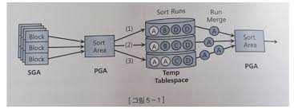

# 소트 연산에 대한 이해

소트머지조인, 해시조인, 그룹핑 등 쿼리 수행 도중 가공된 데이터 집합이 필요하면 PGA 와 temp 테이블스페이스를 활용한다.

## 소트 수행 과정
소트는 PGA 에 할당한 sort area 에서 일어난다. 메모리 공간인 sort area 가 다 차면 디스크 템프 테이블스페이스를 활용하는데, sort area 에서 완료할 수 있는지에 따라 소트 유형은 아래로 나누어진다.

- 메모리 소트는 전체 데이터의 정렬 작업을 메모리 내에서 완료하는 것을 말하며 Internal sort 라고도 한다.
- 디스크 소트는 할당받은 sort area 내에서 정렬을 완료하지 못해 디스크 공간까지 사용하는 경우를 말하며 External sort 라고도 한다.



위는 디스크 소트 과정을 표현한 것으로, 소트할 대상 집합을 sga 버퍼캐시를 통해 읽고, 일차적으로 sort area 에서 정렬을 시도한다. 여기서 정렬을 마무리하는게 좋지만, 양이 많으면 템프 테이블스페이스에 임시 세그먼트를 만들어 정렬된 중간집합을 저장한다.
sort area 가 찰때마다 템프영역에 저장한 중간 단계의 집합을 sort run 이라 한다.

정렬된 최종 결과집합을 얻으려면 이를 다시 머지해야하는데, 각 sort run 은 이미 정렬된 상태이므로 어렵지 않다.

소트 연산은 메모리/CPU 집약적이며, 처리할 데이터량이 많을땐 디스크 IO 까지 발생하므로 쿼리 성능을 좌우하는 중요한 요소이다. 디스크 소트가 발생하는 순간 쿼리 수행 성능은 나빠진다.

많은 서버 리소스를 사용하고 디스크 IO 가 발생하는 것도 문제지만, 부분범위 처리를 불가능하게 해서 OLTP 에서 성능을 저하시키는 주요인이 된다. 가능하면 소트가 발생하지 않도록 쿼리를 작성하고, 불필요하다면 메모리 내에서 수행을 완료할 수 있도록 해야한다.


## 소트 오퍼레이션

### Sort Aggregate

Sort Aggregate 는 전체 로우를 대상으로 집계를 수핼할 떄 나타난다. sort 라 표현하긴 하지만 실제 데이터를 정렬하진 않고, sort area 를 사용한다는 의미로 이해하면 된다.

```sql
explain plan for select sum(sal), max(sal), min(sal), avg(sal) from emp;
SELECT * FROM TABLE(DBMS_XPLAN.DISPLAY(NULL, NULL, 'TYPICAL'));

---------------------------------------------------------------------------
| Id  | Operation          | Name | Rows  | Bytes | Cost (%CPU)| Time     |
---------------------------------------------------------------------------
|   0 | SELECT STATEMENT   |      |     1 |    13 |     2   (0)| 00:00:01 |
|   1 |  SORT AGGREGATE    |      |     1 |    13 |            |          |
|   2 |   TABLE ACCESS FULL| EMP  |     1 |    13 |     2   (0)| 00:00:01 |
---------------------------------------------------------------------------
```

데이터를 정렬하지 않고 SUM, MAX, MIN, AVG 값을 구하는 절차는 아래와 같다.

1. sort area 에 SUM, MAX, MIN, COUNT 값을 위한 변수를 각각 하나씩 할당한다.
2. EMP 테이블 첫 레코드에서 읽은 SAL 값을 SUM, MAX, MIN 변수에 저장하고 COUNT 변수에는 1을 저장한다.
3. EMP 에서 레코드를 하나씩 읽어 내려가면서 SUM 변수에는 값을 누적하고, MAX 변수에는 큰 값이 나타날 떄만 값을 대체하고, MIN 에는 작은값이 나타날 때만 대체한다. COUNT 변수에는 SAL 값이 NULL 이 아이면 1씩 증가시킨다.
4. EMP 를 다 읽으면 SUM, MAX, MIN, COUNT 변수에 각각 14000, 5000, 1000, 5 가 저장된다. SUM, MAX, MIN 는 그대로 출력하고, AVG 는 SUM 을 COUNT 로 나눈 값으로 출력된다.

### Sort Order By
앞서 언급한 데이터를 정렬할 떄 나타난다.

```sql
select * from emp order by sal desc;

---------------------------------------------------------------------------
| Id  | Operation          | Name | Rows  | Bytes | Cost (%CPU)| Time     |
---------------------------------------------------------------------------
|   0 | SELECT STATEMENT   |      |     1 |    87 |     3  (34)| 00:00:01 |
|   1 |  SORT ORDER BY     |      |     1 |    87 |     3  (34)| 00:00:01 |
|   2 |   TABLE ACCESS FULL| EMP  |     1 |    87 |     2   (0)| 00:00:01 |
---------------------------------------------------------------------------
```

### Sort Group By
소팅을 이용해 그룹별 집계를 수행할 떄 나타난다.

```sql
select deptno, sum(sal), max(sal), min(sal), avg(sal) from emp group by deptno order by deptno;

---------------------------------------------------------------------------
| Id  | Operation          | Name | Rows  | Bytes | Cost (%CPU)| Time     |
---------------------------------------------------------------------------
|   0 | SELECT STATEMENT   |      |     1 |    26 |     3  (34)| 00:00:01 |
|   1 |  SORT GROUP BY     |      |     1 |    26 |     3  (34)| 00:00:01 |
|   2 |   TABLE ACCESS FULL| EMP  |     1 |    26 |     2   (0)| 00:00:01 |
---------------------------------------------------------------------------

```

부서가 10, 20, 30, 40 총 네개 있고, 부서별 급여(sal)에 대한 합계, 최대값, 최소값, 평균값을 집계하고자 할 때 아래와 같이 한다.

1. 부서를 구분한 메모지를 준비하고, 각 메모지에 SUM, MAX, MIN, COUNT 를 적을 수 있도록 준비하고, 메모지를 부서번호 순으로 정렬한다.
2. 각 사원의 급여 정보를 읽으며, 사원의 부서번호에 해당다는 메모지를 찾는다. 정렬돼 있으므로 어렵지않다.
3. 메모지를 찾으면 SUM, MAX, MIN, COUNT 를 Sort aggregate 와 동일하게 갱신한다.

위 방식은 부서 수를 미리 안다고 전제한 것으로, 부서 수를 알 수 없다면 급여 대장을 읽다가 새로운 부서가 나타날 떄마다 새로 준비한 메모지를 정렬 순서에 맞춰 중간에 끼워 넣어야 한다.

**위 방식을 이용하면 사원이 수억명이라도 부서 수만큼의 메모지만 필요하며, 부서가 많지 않다면 sort area 가 클 필요가 없고, 집계할 대상 레코드가 많아도 템프 테이블스페이스를 쓰지 않는다는 의미이다.**


#### hash group by
Group by 뒤에 Order by 를 명시하지 않으면 Hash Group By 로 처리된다.

sort group by 는 메모지를 찾기 위해 소트를 이용했다면, hash group by 는 해싱 알고리즘을 이용한다. 

```
f(x)    ---------->  40 sum / count / max / min
해시함수  ---------->  10 sum / count / max / min
        ---------->  30 sum / count / max / min
        ---------->  20 sum / count / max / min
```

읽는 레코드마다 group by 컬럼의 해시값으로 해시 버킷을 찾아 그룹별로 집계항목을 갱신한다. 마찬가지로 부서수(그룹개수)가 많지 않으면 레코드가 아무리 많아도 템프 테이블스페이스를 사용하지 않는다.

```sql
select deptno, sum(sal), max(sal), min(sal), avg(sal) from emp group by deptno;

---------------------------------------------------------------------------
| Id  | Operation          | Name | Rows  | Bytes | Cost (%CPU)| Time     |
---------------------------------------------------------------------------
|   0 | SELECT STATEMENT   |      |     1 |    26 |     3  (34)| 00:00:01 |
|   1 |  HASH GROUP BY     |      |     1 |    26 |     3  (34)| 00:00:01 |
    |   2 |   TABLE ACCESS FULL| EMP  |     1 |    26 |     2   (0)| 00:00:01 |
---------------------------------------------------------------------------

```

#### 그룹핑 결과의 정렬 순서
hash group by 는 정렬을 이용하지 않으므로 당연히 그룹핑 결과가 정렬 순서를 보장하지 않는다. sort group by 는 소팅으로 값을 집계한다는 의미일 뿐, 이 역시 결과가 정렬되어 출력되진 않는다. 
정렬을 원한다변 반드시 쿼리에 order by 를 명시해야 한다.

즉, 같은 sort order by 라도 order by 유무에 따라 정렬 순서가 달라진다. 그 이유는 소팅 알고리즘을 사용해 그룹핑한 결과집합은 논리적인 정렬 순서를 갖는 연결리스트 구조다. 사용자가 order by 를 명시하면 오라클은 논리적 정렬 순서를 따라 값을 읽어 정렬 순서가 보장된다.

물리적으로 저장된 순서는 논리적 순서와 다를 수 있고, order by 가 없으면 정렬해서 출력할 이유는 없다. 이때는 논리적 순서를 무시하고 물리적으로 저장된 순서에 따라 값을 읽으므로 정렬을 보장하지 않는다.

**결론적으로 정렬된 그룹핑 결과를 얻고싶으면 실행계획에 sort group by 라 표시되어도 반드시 order by 를 명시해야 한다.**


### Sort Unique
옵티마이저가 서브쿼리를 풀어 일반 조인문으로 변환하는 것을 서브쿼리 Unnesting 이라 한다. Unnesting 된 서브쿼리가 M 쪽 집합이면 메인쿼리와 조인하기 전에 중복 레코드부터 제거해야 하는데, 이때 sort unique 오퍼레이션이 나타난다.

```sql
select /** ordered use_nl(dept) */ * 
from dept
where deptno in (
    select /** unnest */ deptno
    from emp
    where job = 'CLERK'
);

----------------------------------------------------------------------------------------
| Id  | Operation                    | Name    | Rows  | Bytes | Cost (%CPU)| Time     |
----------------------------------------------------------------------------------------
|   0 | SELECT STATEMENT             |         |     1 |    66 |     4  (25)| 00:00:01 |
|   1 |  NESTED LOOPS                |         |     1 |    66 |     4  (25)| 00:00:01 |
|   2 |   NESTED LOOPS               |         |     1 |    66 |     4  (25)| 00:00:01 |
|   3 |    SORT UNIQUE               |         |     1 |    19 |     2   (0)| 00:00:01 |
|*  4 |     TABLE ACCESS FULL        | EMP     |     1 |    19 |     2   (0)| 00:00:01 |
|*  5 |    INDEX UNIQUE SCAN         | PK_DEPT |     1 |       |     0   (0)| 00:00:01 |
|   6 |   TABLE ACCESS BY INDEX ROWID| DEPT    |     1 |    47 |     1   (0)| 00:00:01 |
----------------------------------------------------------------------------------------
```

만약 PK/Unique 제약 또는 Unique 인덱스로 unnesting 된 서브쿼리의 유일성이 보장되면 sort unique 는 생략된다.

union, minus, intersect 같은 집합연산을 이용할떄도 sort unique 가 나타난다.

```sql
select job, mgr
from emp
where deptno = 10
union
select job, mgr
from emp
where deptno = 20;
```

distinct 연산자에서도 나타난다. order by 를 생략하면 group by 와 마찬가지로 hash unique 방식을 이용한다.

```sql
select distinct deptno from emp order by deptno
```

### Sort Join
소트 머지 조인을 수행할 때 나타난다.

```sql
select /** ordered use_merge(e) */ *
from dept, emp
where dept.deptno = emp.deptno
```


# 소트가 발생하지 않도록 SQL 작성
소트는 불필요하게 발생하지 않도록 해야한다. union, minus, distinct 는 중복 레코드를 제거하기 위한 소트 연산을 발생시키므로 꼭 필요한 경우에만 사용하고, 성능이 느리면 소트를 피할 방법을 찾아야 한다.

## Union vs Union All
Union 은 상단/하단 두 집합 간 중복을 제거하기 위해 소트를 수행하고, Union All 은 중복 확인을 하지 않고 단순히 결합하므로 소트가 없다. 즉, 왠만하면 Union All 이 좋다.

물론 두 연산의 결과집합은 달라질 수 있으므로 Union 대신 Union All 을 사용해도 되는지는 데이터 중복 발생 여부에 따라 달라진다.

```sql
select *
from 결제
where 결제수단코드 = 'M'
union
select *
from 결제
where 결제수단코드 = 'C'
```

위 쿼리는 데이터가 중복될 가능성이 없으므로 Union All 을 이용하는게 좋다.

```sql
select *
from 결제
where 결제일자 = '20180316'
union
select *
from 결제
where 주문일자 = '20180316'
```

위 쿼리는 데이터가 중복될 가능성이 있으므로 단순히 Union All 로 변경하면 안된다. 대신, 아래 쿼리의 조건을 주문일자 = '20180316' and 결제일자 != '20180316' 인 경우에는 중복된 레코드가 없으므로 Union All 로 변경 가능하다.

## Exists 활용
중복 레코드 제거를 위해 Distinct 를 사용하곤하는데, 이는 조건에 해당하는 데이터를 모두 읽어서 중복을 제거해야 한다. 부분범위처리는 당연히 불가능하고, 모든 데이터를 읽는 과정에 많은 IO 가 발생한다.

Exists 서브쿼리는 데이터 존재 여부만 확인하면 되기 때문에 조건절을 만족하는 데이터를 모두 읽지 않는다. Distinct, minus 연산자를 사용한 쿼리는 대부분 Exists 로 변환 가능하니 검토해보는게 좋다.


# 인덱스를 이요한 소트 연산 생략
인덱스는 정렬되어 있어 이를 이용하면 order by , group by 가 있어도 정렬을 생략할 수 있다.

## Sort order by 생략
아래에서 인덱스가 종목코드만 구성되어 있으면 소트 연산을 생략할 수 없어 sort order by 연산을 수행한다. 즉, 모든 KR1234 에 대한 모든 데이터를 다 읽고 소트한 후 출력을 시작하므로 빠르게 응답할 수 없다.

```sql
select *
from 종목거래
where 종목코드 = 'KR1234'
order by 거래일시
```

인덱스 선두 컬럼을 (종목코드, 거래일시)로 구성하면 소트 연산을 생략 가능하고, KR1234 조건을 만족하는 모든 레코드를 읽지 않고도 바로 결과집합을 출력하는 부분범위 처리가 가능한 상태가 된다.
이것만 해도 소트해야 할 대상 레코드가 무수히 많은 상황에서 극적인 성능 개선 효과를 얻는다.

### 부분범위 처리
클라이언트와 DB 사이에 WAS 등이 존재하는 3-tier 아키텍처에서는 서버 리소스를 수많은 클라이언트가 공유하는 구조라, 특정 DB 커넥션을 독점할 수 없다. 단위 작업을 마치면 커넥션을 바로 반호나해야 하므로 그 전에 쿼리 결과를 모두 전송하고 커서를 닫아야 한다.
즉, 쿼리 결과집합을 조금씩 나눠서 전송하는 방식을 사용할 수 없다.

## Top N 쿼리
전체 결과집합 중 상위 N개 레코드만 선택하는 쿼리다.