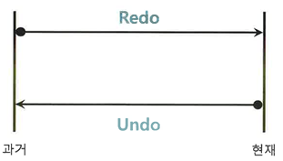
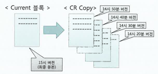
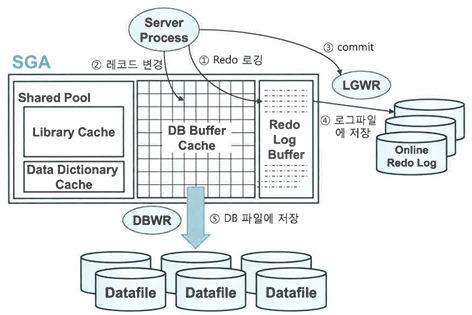
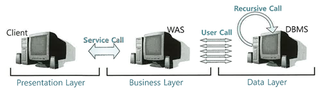
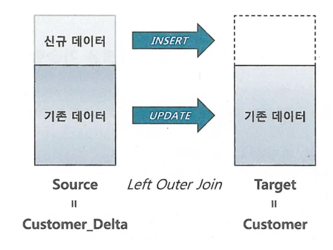

# 기본 DML 튜닝

## DML 성능에 영향을 미치는 요소

### 인덱스와 DML 성능
테이블에 레코드를 입력할 때는 Freelist(테이블마다 관리하는 데이터 입력이 가능한 블록 목록) 를 통해 레코드를 입력할 블록을 할당받지만, 인덱스는 정렬된 자료구조이므로 수직적 탐색을 통해 입력할 블록을 찾아야 한다.
인덱스에 입력하는 과정이 더 복잡하므로 DML 성능에 미치는 영향도 크다.


테이블에서 레코드를 삭제할 땐, 인덱스 레코드를 모두 찾아서 삭제해야 한다. **반면 UPDATE 는 변경된 컬럼을 참조하는 인덱스만 찾아서 변경하면 된다.** 대신, 인덱스는 정렬된 자료구조이므로 테이블에서 한건 변경할 때마다 인덱스에는 두개(삭제 후 삽입) 오퍼레이션이 발생한다.

결국 인덱스 수가 DML 성능에 영향이 있으므로, 핵심 트랜잭션 테이블에서 인덱스 하나라도 줄이면 TPS(Transaction Per Second) 는 향상된다.

### 무결성 제약과 DML 성능

보통 무결정을 지키기위해 DBMS 에서 제공하는 PK, FK, check, notnull 같은 제약을 설정한다.

PK, FK 제약은 Check, Not null 제약보다 성능에 더 큰 영향을 미친다. check, not null 은 정의한 제약조건을 준수하는지만 확인하지만, PK, FK 는 실제 데이터를 조회해봐야 한다.


### Redo 로깅과 DML 성능
오라클은 데이터파일과 컨트롤 파일에 가해지는 모든 변경사항을 Redo 로그에 기록한다. 이는 데이터가 유실됐을 때 트랜잭션을 재현함으로써 유실 이전 상태로 복구하는 데 사용된다.

즉, DML 을 수행할 때마다 redo 로그를 생성해야하므로 DML 성능에 영향을 미친다.

---
### redo 로그 용도

1. 물리적으로 디스크가 꺠졌을 때 복구를 위해 사용한다. 이때는 온라인 redo 로그를 백업해 둔 archived redo 로그를 이용하며, Media Recovery 라고도 한다.
2. cache recovery(instance recovery) 를 위해 사용한다. 모든 디비가 버퍼캐시를 도입하는 이유는 IO 성능을 높이기 위해서인데, 이는 휘발성이다. 이게 유실되는걸 대비하기 위해 리두 로그를 남긴다.
3. Fast commit 을 위해 사용한다. 변경된 메모리 버퍼블록을 디스크 상의 데이터 블록에 반영하는건 랜덤 액세스 방식이라 매우 느리다. 대신, 로그는 append 방식이라 상대적으로 빠르다.
   따라서 트랜잭션에 의한 변경사항을 우선 append 방식으로 빠르게 로그 파일에 기록하고, 변경된 메모리 버퍼블록과 데이터파일 블록의 동기화는 DBWR 를 이용해 일괄처리한다.

Fast commit 은 리두 로그를 믿고 빠르게 커밋을 완료하는 것을 의미한다.

---

### Undo 로깅과 DML 성능

redo 는 트랜잭션을 재현함으로써 과거를 현재 상태로 되돌리는 데 사용하고, undo 는 트랜잭션을 롤백함으로써 현재를 과거 상태로 되돌리는 데 사용한다.
따라서 redo 에는 트랜잭션 재현에 필요한 정보를 담고, undo 는 변경된 블록을 이전으로 통리는 데 필요한 정보를 담는다.



DML 을 수행할 때마다 undo 를 생성하므로 DML 에 영향을 미친다.


---

### undo 의 용도와 MVCC 모델

1. Transaction Rollback: 트랜잭션에 의한 변경사항을 최종 커밋하지 않고 롤백하고자 할 때 Rollback 데이터 이용
2. Transaction Recovery: 인스턴스 Crash 발생 후 Redo를 이용해 최종 커밋되지 않은 변경사항까지 모두 복구된다. 따라서 시스템이 셧다운된 시점에 아직 커밋되지 않았던 트랜잭션들을 모두 롤백해야 하는데, 이때 Undo 데이터 사용
3. Read Consistency: 읽기 일관성을 위해 사용된다. 데이터를 읽다가 블록이 변경되어도 읽기를 수행한 시점의 데이터를 읽을 수 있도록 쿼리 시작 시점으로 Undo 데이터를 적용한다.


### MVCC(Multi-Version Concurrency Control)

MVCC(원본의 데이터와 변경중인 데이터를 동시에 유지하는 방식) 모델을 사용하는 오라클은 데이터를 두 가지 모드로 읽는다.

- Current 모드: 디스크에서 캐시로 적재된 원본 블록을 현재 상태 그대로 읽는 방식
- Consistent 모드: consistent 는 쿼리가 시작된 이후 다른 트랜잭션에 의해 변경된 블록을 만나면 원본 블록을 복사하고, 복사본 블록에 언두 데이터를 적용하여 쿼리가 시작된 시점으로 되돌려서 읽는 방식이다. 즉, 원본 블록 하나에 여러 복사본이 캐시에 존재할 수 있다.





오라클은 시스템에서 마지막 커밋이 발생한 시점정보를 SCN(System Commit Number)이라는 글로벌 변수값으로 관리한다. 이는 기본적으로 각 트랜잭션이 커밋될 때 1씩 증가하고, 오라클 백그라운드 프로세서에 의해서도 조금씩 증가한다.
 
SCN 은 아래 두 종류로 나뉜다.

- 블록 SCN: 오라클은 각 블록이 마지막으로 변경된 시점을 관리하기 위해 모든 블록 헤더에 SCN 을 기록한다.
- 쿼리 SCN: 모든 쿼리는 글로벌 변수인 SCN 값을 먼저 확인하고서 읽기 작업을 시작한다.

Consistent 모드는 쿼리 SCN과 블록 SCN을 비교함으로써 중간에 블록이 변경되었는지 확인하고 데이터를 읽는다. 블록 SCN이 쿼리 SCN보다 크다면 블록 복사본을 만들고 Undo를 수행해서 시작된 시점으로 되돌리는데 중간에 다른 트랜잭션이 Undo 데이터를 재사용하여 실패하는 경우에는 ORA-01555 에러가 발생한다고 한다.

SELECT 문은 주로 Consistent 모드로 읽고 DML 문은 Consistent 모드로 시작 지점 상태의 블록을 찾고 Current 모드로 갱신(추가/변경/삭제)한다.

---

### Lock 과 DML 성능
락을 필요 이상으로 자주, 길게 사용하거나 격리 수준을 높일수록 DML 은 느려진다. 필요한 격리 수준을 사용하지 않으면 데이터 품질이 나빠질 수 있으므로 이는 트레이드 오프이다.


### 커밋과 DML 성능
DML 을 끝내려면 커밋까지 완료해야 하므로 서로 밀접한 관련이 있다. 

모든 DBMS 는 갱신한 데이터가 아무리 많아도 커밋은 빠르게 처리해주는 Fast Commit 을 구현한다. 이를 이용해 커밋을 빠르게 처리하긴 하지만 커밋은 가벼운 작업은 아니다.

####  DB 버퍼캐시
버퍼캐시에 변경된 블록을 모아 주기적으로 데이터파일에 일괄 기록하는 작업은 DBWR(Database Writer) 프로세스가 맡는다. 일을 건건이 처리하지 않고 모았다가 일괄처리한다.

#### redo 로그 버퍼
버퍼캐시는 휘발성이므로 DBWR 이 더티블록을 데이터파일에 반영할 때까지 위험한 상태이다. 그래서 버퍼캐시에 가한 변경사항은 리두 로그에도 기록하여 버퍼캐시 데이터가 유실돼도 리두 로그로 복구가능하다.

다만, 리두 로그도 파일이라 append 로 기록해도 디스크 IO 가 발생하게 된다. 이를 위해 리두 파일에 기록하기 전에 먼저 로그 버퍼에 기록한다. 이는 나중에 LGWR 프로세스가 리두 로그 파일에 일괄 기록한다.

#### 트랜잭션 데이터 저장 과정
한 트랜잭션이 데이터를 변경하고 커밋하는 과정, 그리고 변경된 블록을 데이터 파일에 기록하는 과정은 아래와 같다.



1. DML 실행 시 리두 로그버퍼에 변경사항 기록
2. 버퍼블록에서 데이터 변경
3. 커밋
4. LGWR 프로세스가 리두 로그 버퍼 내용을 로그 파일에 일괄 저장
5. DBWR 프로세스가 변경된 버퍼블록들을 데이터파일에 일괄 저장

오라클은 데이터를 변경하기 전 항상 로그부터 기록하는데, 이를 Write Ahead Logging 이라 한다. 여기서 버퍼캐시가 휘발성이라 리두 로그를 남기는데, 리두 로그마저 휘발성인 로그버퍼에 기록하는게 이상하다.

잠자던 DBWR 와 LGWR 는 주기적으로 더티블록과 리두 로그버퍼를 파일에 기록한다. 그런데 LGWR 는 서버 프로세스가 커밋을 발행했다고 신호를 보내면 이때도 활동을 시작한다. 
즉, 적어도 커밋시점에는 리두 로그버퍼 내용을 로그파일에 기록한다는 의미이며, 이를 Log Force at Commit 이라 한다.

서버 프로세스가 변경한 버퍼블록을 디스크에 기록하지 않았더라도 커밋 시점에 리두 로그를 디스크에 안전하게 기록한다면 이 순간부터 트랜잭션의 영속성은 보장된다.

#### 커밋 = 저장버튼

커밋은 서버 프로세스가 그때까지 햇던 작업을 디스크에 기록하라는 명령어다. 리두 로그버퍼에 기록된 내용을 디스크에 기록하도록 LGWR 에 신호를 보낸 후 작업을 완료했다는 신호를 받아야 다음 작업을 진행할 수 있다.
동기 방식으로, LGWR 가 리두 로그를 기록하는 작업은 디스크 IO 이므로 커밋은 생각보다 느리다.

오랫동안 커밋하지 않은 채 데이터를 계속 갱신하면 undo 공간이 부족해져 시스템 장애 상황이 발생할 수 있고, 루프를 돌며 건건이 커밋하면 프로그램 자체 성능이 느려진다.


## 데이터베이스 call 과 성능

### 데이터베이스 call
SQL은 아래 세 단계로 나누어 실행한다.

- parse call: SQL 파싱과 최적화를 수행하는 단계다. SQL과 실행계획을 라이브러리 캐시에서 찾으면, 최적화 단계는 생략할 수 있다.
- Execute Call : 말 그대로 SQL을 실행하는 단계다. DML은 이 단계에서 모든 과정이 끝나지만, SELECT 문은 Fetch 단계를 거친다.
- Fetch Call : 데이터를 읽어서 사용자에게 결과집합을 전송하는 과정을 SELECT 문에만 나타난다. 전송할 데이터가 많을 때는 Fetch Call이 여러 번 발생한다.

Call이 어디서 발생하느냐에 따라 User Call과 Recursive Call로 나눌 수 있다.



User Call은 네트워크를 경유해 DBMS 외부로부터 인입되는 Call이다. 최종 사용자(User)는 맨 왼쪽 클라이언트 단에 위치한다. 하지만, DBMS 입장에서 사용자는 WAS(또는 AP 서버)다. 3-Tier 아키텍처에서 User Call은 WAS(또는 AP 서버)서버에서 발생하는 Call이다.

Recursive Call은 DBMS 내부에서 발생하는 Call이다. SQL 파싱과 최적화 과정에서 발생하는 데이터 딕셔너리 조회, PL/SQL로 작성한 사용자 정의 함수/프로시저/트리거에 내장된 SQL을 실행할 때 발생하는 Call이 여기에 해당한다.

User Call이든 Recursive Call이든, SQL을 실행할 때마다 Parse, Execute, Fetch Call 단계를 거친다. 데이터베이스 Call이 많으면 성능은 느릴 수밖에 없다. 특히, 네트워크를 경유하는 User Call이 성능에 미치는 영향은 매우 크다.

### One SQL 
업무 로직이 복잡하면 절차적으로 처리해야겠지만, 그게 아니라면 가급적이면 One SQL 이 훨씬 빠르다.

주로 Insert Into Select, 수정가능 조인 뷰, Merge 문을 활용할 수 있다.

```sql
insert into target (col1, col2) select * from source;
```

### Array Processing 활용

실무에서는 복잡한 업무 로직을 포함하는 경우가 많기 때문에 절차적 프로그램을 One SQL로 구현하는 일은 절대 쉽지 않다. 그럴 때 Array Processing 기능을 활용하면 One SQL로 구현하지 않고도 Call 부하를 획기적으로 줄일 수 있다.

```kotlin
import java.sql.Connection
import javax.sql.DataSource

data class UserRow(val id: Long, val name: String)

fun bulkInsertUsers(dataSource: DataSource, rows: List<UserRow>, batchSize: Int = 1000) {
val sql = "INSERT INTO users (id, name) VALUES (?, ?)"

    dataSource.connection.use { conn ->
        conn.autoCommit = false

   conn.prepareStatement(sql).use { ps ->
           var count = 0

      for (r in rows) {
         ps.setLong(1, r.id)
         ps.setString(2, r.name)
         ps.addBatch()              // <-- 바인드 값을 모아두기(배열 처리 포인트)
         count++

         if (count % batchSize == 0) {
            ps.executeBatch()       // <-- 모아둔 것들을 한 번에 전송/실행
            ps.clearBatch()
         }
      }

      // 남은 것 처리
      if (count % batchSize != 0) {
         ps.executeBatch()
         ps.clearBatch()
      }
   }

   conn.commit()
}
}
```
한 건씩 executeUpdate() 하면 매 행마다 DB 왕복이 생길 수 있기에 addBatch()로 여러 행의 바인드 값을 모아 executeBatch()로 보내면 왕복 횟수가 (건수 → 건수/batchSize) 줄어든다.

백만번 발생하는 call 을 만번에 한번씩 insert 하도록하여 백번으로 줄이면 One SQL 에 준하는 성능 효과를 얻는다.


## 인덱스 및 제약 해제를 통한 대량 DML 튜닝

인덱스와 무결성 제약은 DML 성능에 영향을 준다. OLTP 시스템에서는 이를 해제할 순 없지만, 동시성 이슈가 없는 대량 데이터를 적재하는 배치에서는 이들을 해제햐여 성능을 개선시킬 수 있다.

얼마나 개선되는지 보자.

아래에 PK 제약으로 생성된 Unique 인덱스와 일반 인덱스 총 두개가 있다. 여기에 천만건의 데이터를 넣으면 1분 19초가 걸린다. 
```sql
create table source as
select b.no, a.*
from (select * from emp where rownum <= 10) a
    , (select rownum as no from dual connect by level <= 1000000)b;

create table target
as
select * from source where 1 = 2;

alter table target add constraint target_pk primary key(no, empno)

create index target_x1 on target(ename)
```

여기에 PK 제약 비활성화 및 unique 인덱스 drop + 일반 인덱스 unusable 해보자.

무결성 제약과 인덱스를 해제한 후 천만건을 입력면 5.84초만에 수행한다.

이후, PK 와 일반 인덱스를 재생성하면 각각 8초 정도 걸리는데, 기존보다 더 빨르다는걸 알 수 있다.


## 수정가능 조인 뷰

최근 한 달 동안 거래가 있는 고객에 한해서, 그 기간의 거래를 집계해 고객 요약 컬럼(최종거래일시/횟수/금액)을 업데이트한다.

```sql
UPDATE 고객 c
SET (최종거래일시, 최근거래횟수, 최근거래금액) =
    (SELECT MAX(거래일시), COUNT(*), SUM(거래금액)
       FROM 거래
      WHERE 고객번호 = c.고객번호
        AND 거래일시 >= TRUNC(ADD_MONTHS(SYSDATE, -1)))
WHERE EXISTS (
    SELECT /*+ unnest hash_sj */ 'x'
      FROM 거래
     WHERE 고객번호 = c.고객번호
       AND 거래일시 >= TRUNC(ADD_MONTHS(SYSDATE, -1))
);
```
SET (...) = (SELECT ...) 쪽에서 거래 테이블을 한 번 읽고,
WHERE EXISTS (SELECT ... FROM 거래 ...) 쪽에서 거래 테이블을 또 읽는다.
즉, 고객 대상 업데이트를 하면서 거래를 2번 조인/탐색한다.


아래는 수정 가능 조인 뷰이다.
조인뷰는 from 절에 두개 이상 테이블을 가진 뷰고, 입력, 수정, 삭제가 허용되는 조인 뷰를 수정가능 조인 뷰라 한다.

1쪽 집합과 조인하는 M쪽 집합에만 입력, 수정, 삭제가 허용된다(1: 고객, M: 거래).
```sql
UPDATE (
    SELECT /*+ ordered use_hash(c) no_merge(t) */
           c.최종거래일시, c.최근거래횟수, c.최근거래금액,
           t.거래일시,   t.거래횟수,   t.거래금액
      FROM (
            SELECT 고객번호,
                   MAX(거래일시) 거래일시,
                   COUNT(*)      거래횟수,
                   SUM(거래금액) 거래금액
              FROM 거래
             WHERE 거래일시 >= TRUNC(ADD_MONTHS(SYSDATE, -1))
             GROUP BY 고객번호
           ) t,
           고객 c
     WHERE c.고객번호 = t.고객번호
)
SET 최종거래일시 = 거래일시,
    최근거래횟수 = 거래횟수,
    최근거래금액 = 거래금액;
```


## Merge 문 활용

DW 에서는 기간계 시스템에서 가져온 신규 트랜잭션 데이터를 동기화하는 작업이 흔하다.

고객 테이블에 발생한 변경분 데이터를 DW 에 반영하는 프로세스는 아래와 같다.

1. 전일 발생한 변경 데이터를 기간계 시스템으로부터 추출
```sql
CREATE TABLE customer_delta
AS
SELECT *
  FROM customer
 WHERE mod_dt >= TRUNC(SYSDATE) - 1
   AND mod_dt <  TRUNC(SYSDATE);
```

2. CUSTOMER_DELTA 테이블을 DW 시스템으로 전송
3. DW 시스템으로 적재
```sql
MERGE INTO customer t
USING customer_delta s
   ON (t.cust_id = s.cust_id)
WHEN MATCHED THEN
  UPDATE
     SET t.cust_nm = s.cust_nm,
         t.email   = s.email
         -- , ...
WHEN NOT MATCHED THEN
  INSERT (cust_id, cust_nm, email, tel_no, region, addr, reg_dt)
  VALUES (s.cust_id, s.cust_nm, s.email, s.tel_no, s.region, s.addr, s.reg_dt);
```
merge 뭉은 source 테이블 기준으로 target 테이블과 left outer 로 조인해서, 조인에 성공하면 업데이트, 실패하면 인서트한다. 즉, upsert 한다.

위에서 source 는 customer_delta, target 은 customer 다.



실행계획이 같으면 update 를 쓰든 merge 를 쓰든 상관없다.